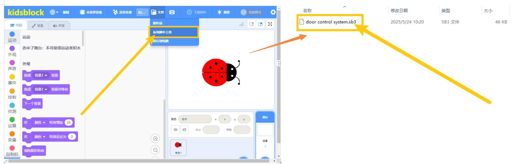
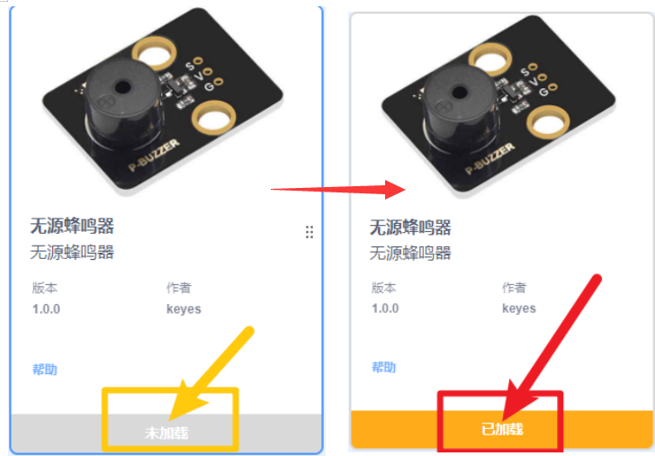

5. Scratch软件下载与配置
========================

5.1 下载资料
------------

\ **Scratch资料包含项目代码，请点击下载才能进行后续的学习！！！！**\ 

资料下载： :download:`Scratch <./Scratch.7z>`

APP下载：  :download:`APP <./APP.7z>`

5.2 软件安装
------------

Windows系统：
~~~~~~~~~~~~~

点击链接 https://xiazai.keyesrobot.cn/KidsBlock.exe下载软件。

.. figure:: ./media/1.gif
   :alt: 1

Mac系统：
~~~~~~~~~

点击链接https://www.kidsblock.cn/Down/KidsBlock-MACOS.dmg下载软件。

.. figure:: ./media/2.gif
   :alt: 2

（首次打开时间稍久，请耐心等待！！！）

5.3驱动安装
-----------

如果无法上传代码，请参考以下教程安装驱动（选读）

1、Windows驱动安装

.. figure:: ./media/17.gif
   :alt: 17

2、Mac驱动安装

.. figure:: ./media/18.gif
   :alt: 18

5.4 KidsBlock软件的使用说明
---------------------------

（以下是以Windows系统为例，MacOS系统可以参考）

1. 软件中各按钮的功能：

|image1|

2. 加载代码文件(*注意代码和开发板的选择以实物为准,不要完全照下列教程选择*\ ）

⽅法 **1**\ ： 双击⽂件（.SB3）直接打开。

⽅法 **2**\ ： 点击“⽂件”，选择“从电脑中上传”，选择⽂件（.SB3）即可。

|image2|

3. 代码上传

加载完代码文件后，确保开发板连接到电脑,点击“\ |image3|\ ”以选择对应开发板，点击\ |image4|\ 选择正确的端⼝，显示端口号证明已连接。

|image5|

最后点击“上传”，上传成功会显示“上传成功”。

.. figure:: ./media/image-20250609141841463.png
   :alt: image-20250609141841463

4. 添加库

   |image6|\ 是添加传感器/模块和元件的扩展包，点击\ |image7|\ 可以进入扩展库界面，例如需要添加无源蜂鸣器模块，点击“无源蜂鸣器”所处区域，“未加载”变成“已加载”，说明“无源蜂鸣器”模块添加成功。

   |image8|

   点击\ |image9|\ ，可以回到代码编辑器界面，在模块区可以看到添加\ |image10|\ 。

   如果需要删除“无源蜂鸣器”模块，只需要点击\ |image11|\ 再次进入传感器/模块扩展库界面，点击“无源蜂鸣器”所处区域，“已加载”变成“未加载”，则说明“无源蜂鸣器”模块删除成功。

   |image12|

   其他的传感器/模块和元器件的添加和删除，方法是一样的。

   **至此，软件已经安装成功，并且可以正常运行，如遇问题请先重新对照教程仔细检查，多次检查后如未解决请联系客服！！！**

.. |image1| image:: ./media/image-20250609110953026.png

.. |image3| image:: ./media/image-20250623121802298.png

.. |image5| image:: ./media/image-20250609114824498.png
.. |image6| image:: ./media/image-20250623160248417.png
.. |image7| image:: ./media/image-20250623160307158.png

.. |image9| image:: ./media/14.png

.. |image11| image:: ./media/12.png
.. |image12| image:: ./media/16.png

5.5 项目课程
-------------------

.. toctree::
    :maxdepth: 1

    Project/项目一
    Project/项目二
    Project/项目三
    Project/项目四
    Project/项目五
    Project/项目六
    Project/项目七
    Project/项目八 
    Project/项目九 
    Project/项目十
    Project/项目十一
    Project/项目十二
    Project/项目十三
    Project/项目十四 
    Project/项目十五 
    Project/项目十六 
    Project/项目十七
