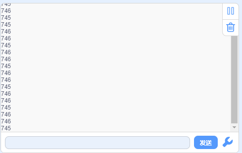

### 项目七 光控灯

1.项目介绍

在这个套件中，有一个Keyes DIY电子积木光敏电阻传感器，这是一个常用的光敏电阻传感器，它主要采用光敏电阻元件。该电阻元件电阻大小随着光照强度的变化而变化，该传感器就是利用光敏电阻元件这一特性，搭建电路将电阻变化转换为电压变化。光敏电阻传感器可以模拟人对环境光线的强度的判断，可广泛应用于各种光控电路，如对灯光的控制、调节等场合，也可用于光控开关。

实验中，我们将传感器信号端(S端)输入到arduino系列单片机的模拟口，感知模拟值的变化，在串口监视器上显示出对应的模拟值，当小于某个值时点亮LED灯。

2.模块相关资料

| 工作电压:  | DC 3.3-5V          |
| ---------- | ------------------ |
| 工作电流： | &lt; 20mA          |
| 最大功率： | 0.1W               |
| 控制接口:  | 输出信号：模拟信号 |
| 工作温度： | -10°C ~ +50°C      |

3.实验组件

| 控制板 * 1                               | 扩展板 * 1                               | USB线* 1                                 |
| ---------------------------------------- | ---------------------------------------- | ---------------------------------------- |
|  |  |  |
| 3P 转杜邦线母* 2                         | 黄色LED模块* 1                           | Keyes 光敏电阻传感器*1                   |
|  |  |  |

4.模块接线图

5.实验代码

拖动代码块编写程序：

完整代码如下

6.实验结果

按照上图接好线，上传好程序，利用USB线上电后，点击设置波特率为9600，我们看到在串口显示器中打印出光敏传感器测到的值，光敏电阻传感器测到的值小于等于400时，则黄色LED亮；反之，黄色LED不亮。

7.代码说明

1. 这个代码块从指定的模拟引脚A1     读取值。 Arduino 板包含一个多通道、10 位模数转换器。 这意味着它会将0 和工作电压（5V 或 3.3V我们这里是5V）之间的输入电压映射为 0 和 1023     之间的整数值。例如，在 Arduino UNO     上，这会产生以下读数之间的分辨率：5 伏/1024 单位即每单位 0.0049 伏(4.9 mV)。在基于 ATmega     的板卡（UNO、Nano、Mini、Mega）上，读取模拟输入大约需要 100     微秒（0.0001 s)，因此最大读取速率约为每秒 10,000 次。

2.A1：要读取的模拟输入引脚的名称（大多数板上的A0到A5，我们plus板上的A0到A7，Mega2560上的A0到A15）。函数返回值为引脚上的模拟读数。虽然它受限于模数转换器的分辨率（0-1023     为 10 位或 0-4095 为 12 位）。