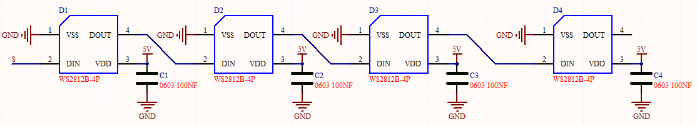
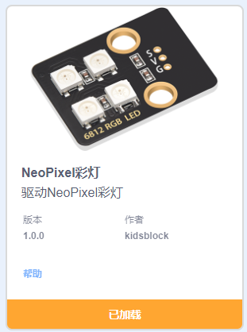
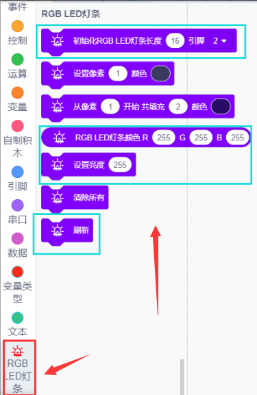
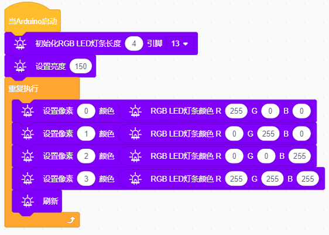

### 项目三 6812RGB彩灯

1.项目介绍

我们这个套价中，还有一个Keyes DIY电子积木 6812 RGB模块，这个SK6812 RGB
模块只需要一个引脚就能控制，这是一个集控制电路与电路于一体的智能外控LED光源。每个LED原件其外型与一个5050LED灯珠相同，每个元件即为一个像点，我们这个模块上有四个灯珠即四个像素，实验中，我们分别使不同的灯亮出不同的颜色。

2.模块相关资料

从原理图中我们可以看出，这四个像素点灯珠都是串联起来的，其实不论多少个，我们都可以用一个引脚控制任一一个灯，并且让它显示任一种颜色。像素点内部包含了智能数字接口数据锁存信号整形放大驱动电路，还包含有高精度的内部振荡器和12V高压可编程定电流控制部分，有效保证了像素点光的颜色高度一致。

数据协议采用单线归零码的通讯方式，像素点在上电复位以后，S端接受从控制器传输过来的数据，首先送过来的24bit数据被第一个像素点提取后，送到像素点内部的数据锁存器。这个6812RGB通讯协议与驱动已经在底层封装好了，我们直接调用函数的接口就可以使用，简单方便，LED具有低电压驱动，环保节能，亮度高，散射角度大，一致性好，超低功率，超长寿命等优点。

3.实验组件

| 控制板 * 1                               | 扩展板 * 1                               | USB线* 1                                 | 6812RGB彩灯模块                          | 3P 转杜邦线母*1                          |
| ---------------------------------------- | ---------------------------------------- | ---------------------------------------- | ---------------------------------------- | ---------------------------------------- |
|  |  |  |  |  |

4.模块接线图

5.实验代码

通过拖动代码块来编写代码程序，操作步骤如下：

先点击左下角的添加RGB代码块

在**事件栏**拖出Arduino启动模块

在**控制栏**拖出重复执行模块

寻找RGB代码块

完整代码如下

6.实验结果

将再将船型开关上的“1”端按下,按照接线图连接好线，上电后，我们可以看到模块上的四个灯珠分别亮红 绿 蓝 白 色；

7.程序说明

|  | 设置RGB模块的灯数和引脚               |
| ---------------------------------------- | ------------------------------------- |
|  | 接在13号引脚的RGB模块第一位灯珠亮红色 |
|  | 接在13号引脚的RGB模块第二位灯珠亮绿色 |
|  | 接在13号引脚的RGB模块第三位灯珠亮蓝色 |
|  | 刷新显示                              |

