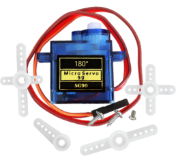
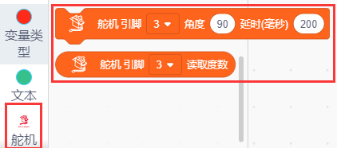

### 项目九 控制舵机

1.项目介绍

当我们在制作智能家居时，经常会将舵机和门、窗等固定在一起。这样，我们就可以利用舵机转动，带动门、窗等开或关，从而起到家居生活的智能化功能。在这课程中我们着重介绍下智能家居套件中的舵机的原理和使用方法。

舵机是一种位置伺服的驱动器，主要是由外壳、电路板、无核心马达、齿轮与位置检测器所构成。与马达不同，我们一般控制马达的转速和方向。而舵机更多的是控制指定的角度。常用的舵机可旋转的角度范围是0°到180°。舵机引线为3线，分别用棕、红、橙三种颜色进行区分，舵机品牌和生产厂家不同，会有些许差异，使用之前需查看资料。我们使用的是最常见的舵机，棕、红、橙分别对应“电源负极，电源正极，控制信号”。

2.舵机相关资料

舵机的伺服系统由可变宽度的脉冲来进行控制，橙色的控制线是用来传送脉冲的。一般而言，PWM控制舵机的基准信号周期为20ms（50Hz），理论上脉宽应在1ms到2ms之间，对应控制舵机角度是0°～180°。但是，实际上更多控制舵机的脉宽范围是0.5ms到2.5ms，具体需要自己实际调试下。

经过实测，舵机的脉冲范围为0.65ms~2.5ms。180度舵机，对应的控制关系是这样的：

| 高电平时间 | 舵机角度 | 基准信号周期时间（20ms）   |
| ---------- | -------- | -------------------------- |
| 0.65ms     | 0度      | 0.65ms高电平+19.35ms低电平 |
| 1.5ms      | 90度     | 1.5ms高电平+18.5ms低电平   |
| 2.5ms      | 180度    | 2.5ms高电平+17.5ms低电平   |

3.实验组件

| 控制板 * 1                               | 扩展板 * 1                               | USB线* 1                                 | 180度舵机*1                              |
| ---------------------------------------- | ---------------------------------------- | ---------------------------------------- | ---------------------------------------- |
|  |  |  |  |

4.模块接线图

5.实验代码

拖动代码块编写程序：

先点击左下角的**舵机代码块**

寻找代码块

完整的代码如下

6.实验结果

上传测试代码成功，外接电源开关打开后，“智能家居的门”由0~90~180度来回转动，停顿时间500ms。

7.

接在管脚9的舵机转动180度，并延时500mS。

