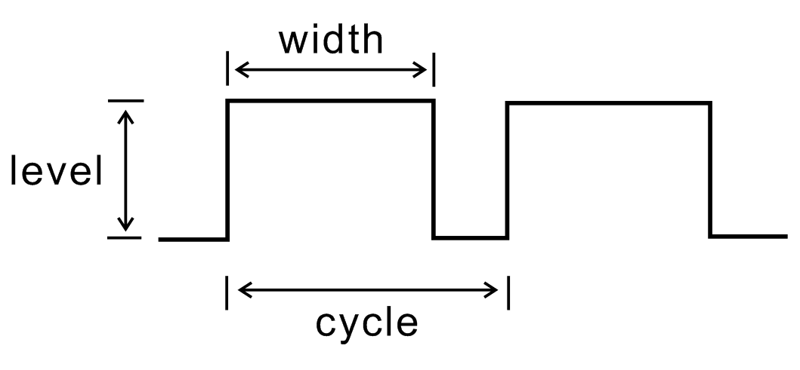
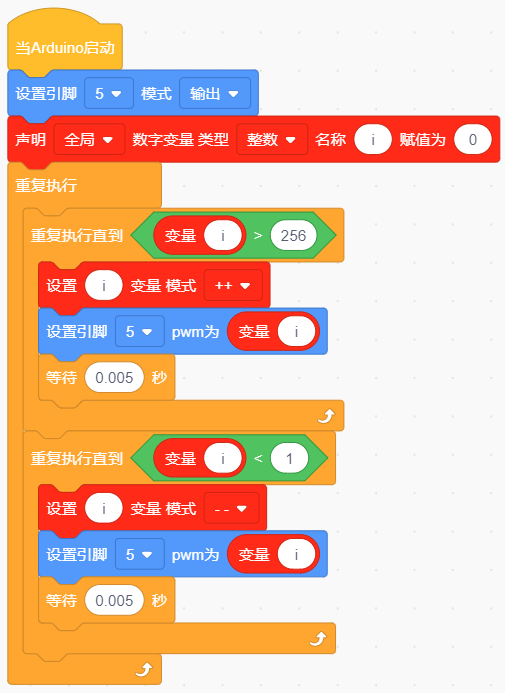
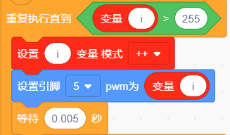
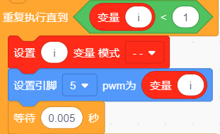

### 项目二 呼吸灯

1.项目介绍

前面课程中，我们详细的介绍了通过测试代码控制LED亮灭，实现闪烁的效果。这节课我们使用PWM来控制LED亮度不断地变化，模拟我们呼吸的效果。

PWM是使用数字手段来控制模拟输出的一种手段。使用数字控制产生占空比不同的方波（一个不停在高电平与低电平之间切换的信号)来控制模拟输出。一般来说端口的输出电压只有两个0V与5V。如果想要改变灯的亮度怎么办呢个？有同学说串联电阻，对，这个方法是正确的。但是，如果想要得到不同的亮度，且在不同亮度之间来回变动怎么办呢？不可能不停地切换电阻吧。这种情况下就需要使用PWM了，那它是怎么控制的呢？

对于keyes UNO PLUS开发板的数字端口电压输出只有高与低两个，对应的就是0V与5V的电压输出，可以把低电平定义为0，高电平定义为1，1秒内让keyes UNO PLUS开发板输出500个0或者1的信号。如果这500个全部为1，那就是完整的5V，如果全部为0，那就是0V。如果010101010101这样输出，刚好一半，端口输出的平均电压就为2.5V了。这个和放映电影是一个道理，咱们所看的电影并不是完全连续的，它其实是每秒输出25张图片。在这种情况下，人的肉眼是分辨不出来的，看上去就是连续的了。PWM也是同样的道理，如果想要不同的电压，就控制0与1的输出比例控制就可以了。当然这和真实的连续输出还是有差别的，单位时间内输出的0,1信号越多，控制的就越精确。（输出电压=（开启时间/脉冲时间）\*最大电压值）

在下图中，绿线之间代表一个周期，其值也是PWM频率的倒数。换句话说，如果keyes UNO PLUS开发板的PWM频率是500Hz，那么两绿线之间的周期就是2毫秒。

脉冲宽度调制（PWM）有多种应用：灯亮度调节、电机调速、发声等。
以下是PMW的四个基本参数：

- 脉冲宽度的振幅（最小/最大）

- 脉冲周期（1秒内脉冲频率的倒数）

- 电压水平（如：0V-5V）

- keyes UNO PLUS开发板的PMW接口：D3 D5 D6 D9 D10 D11

2.模块相关资料

| 工作电压:     | DC 3.3-5V          |
| ------------- | ------------------ |
| 工作电流：    | &lt; 20mA          |
| 最大功率：    | 0.1W               |
| 控制接口:     | 数字口（数字输入） |
| 工作温度：    | -10°C ~ +50°C      |
| LED显示颜色： | 黄色               |

3.实验组件

| 控制板 * 1                               | 扩展板 * 1                               | USB线 *1                                 | LED模块                                  | 3P 转杜邦线母 *1                         |
| ---------------------------------------- | ---------------------------------------- | ---------------------------------------- | ---------------------------------------- | ---------------------------------------- |
|  |  |  |  |  |

4.模块接线图

注意：这里体现的是实验使用到的模块接线图，若前面已经组装好智能家居并不用拆掉。

5.实验程序

通过拖动代码块来编写代码程序，操作步骤如下：

①在**事件**栏里拉出“Arduino启动”模块。

②在**引脚栏**拖出设置引脚输入/输出模块

③在**变量类型**栏中拖出声明全局变量模块并设置变量名为“i”

④在**控制栏**拖出无限循环模块

⑤然后再拖出重复执行直到模块

⑥然后在重复执行里加运算栏的大于模块，然后在变量类型栏下拖出变量模块变量名为
i ，最后设置数字为255

⑦在变量类型下做出设置变量加一的模块，并设置变量名为 i

⑧在**引脚栏**下拖出设置引脚为PWM模块，并添加变量i为PWM值

⑨在**控制栏**拖出延时模块，设置延时为0.005秒

⑩再拖出重复执行直到模块

⑪然后在重复执行里加运算栏的小于模块，然后在变量类型栏下拖出变量模块变量名为
i ，最后设置数字为1

⑫在变量类型下做出设置变量减一的模块，并设置变量名为 i

⑬在**引脚栏**下拖出设置引脚为PWM模块，并添加变量i为PWM值

⑭在**控制栏**拖出延时模块，设置延时为0.005秒

完整代码

6.实验结果

将再将船型开关上的“1”端按下，黄色LED灯逐渐变暗。然后又逐渐变亮，循环交替，如人体呼吸一样。

7.代码说明

|  | 定义变量i为整型并赋值为0    |
| ---------------------------------------- | --------------------------- |
|  | i从0到255，每次加1，间隔5ms |
|  | i从255到0，每次减1，间隔5ms |