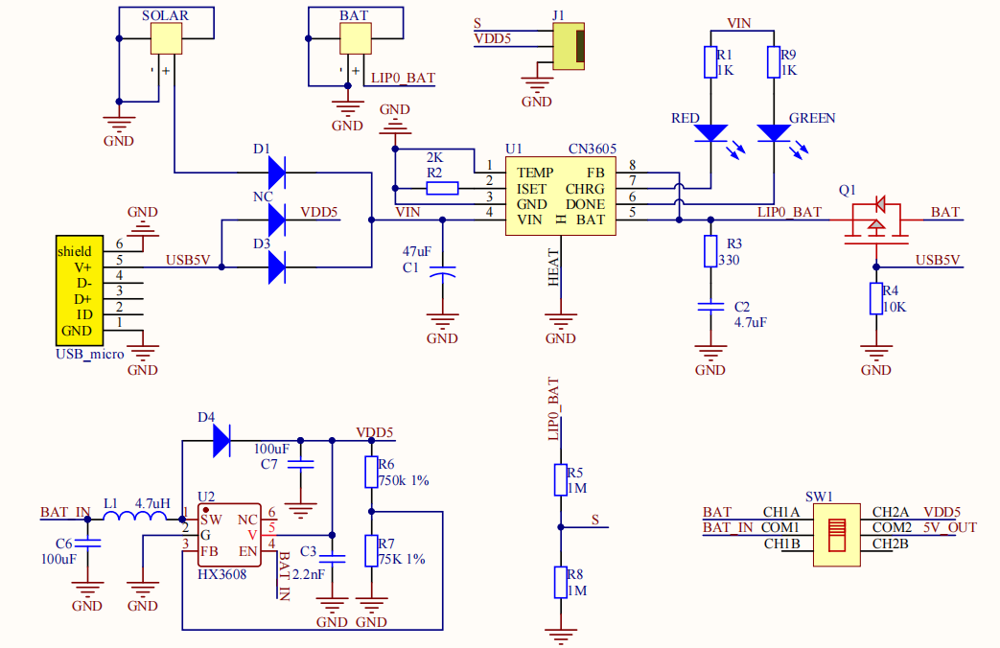
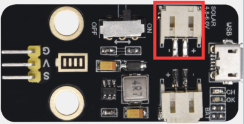
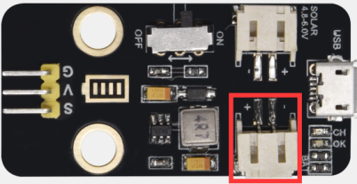
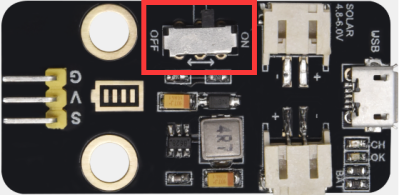
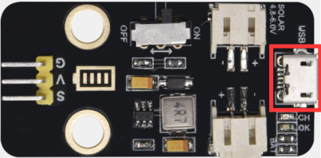

### 项目五 太阳能与USB充电锂电池电源模块 

1.实验介绍

本模块集成一片充放电芯片，通过PH2.0MM接口可以外接可充电电池，我们使用了单节锂电池。模块有一个micro USB充电口与一个太阳板充电口，通过任意一个口都可以对外接的锂电池进行充电。模块上也集成一个升压模块，可将电池电压升到6.6V。通过3P黄色弯排针G、V脚可以输出6.6V电压，排针的S脚可以读取电阻1/2分压后的电池电压，模块上的拨动开关就是3P弯针6.6V的电压输出开关

2.模块规格参数

| 充电接口             | Micro USB 与 HP2.0MM太阳能板接口 |
| -------------------- | -------------------------------- |
| 太阳能板接口输入电压 | 4.4-6V                           |
| 电池恒压充电值       | 4.15-4.24V                       |
| 最大充电电流         | 800mA                            |
| 输出接口             | 3 P 2.54mm 弯针排针              |
| 输入电压             | 6.6V                             |
| 最大输出电流         | 1A                               |
| 外接电池             | 单节锂电池                       |
| 环保属性             | ROHS                             |

3.模块的原理图 

4.模块的简单功能

SOLAR4.8-6.0V端是接太阳能板，太阳能通过太阳能板转化成电能，是电源输入端。

BAT端是接电池盒（可充电电池）的，是电源输出端，给电池充电，可将电能储存在电池内。

这个拨动开关是电源开关，拨到ON端是接通外接单节锂电池，这样单节锂电池的电压通过模块升压到6.5V从G、V引脚流向Plus开发板，给开发板供电；反之，拨到OFF端是断开外接单节锂电池的电流。

通过microUSB线连接到USB接口和电脑是可以给外接单节锂电池充电的。