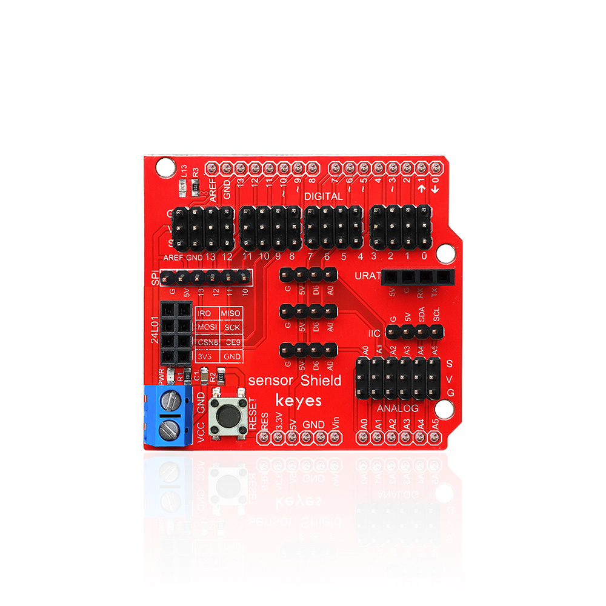
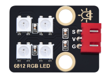

### 项目六 按键控灯

1.项目介绍

按键模块按下我们的单片机读取到低电平，松开读取到高电平。在这一实验课程中，我们利用按键和RGB做一个扩展，当按键按下时即读取到低电平时我们点亮RGB灯，松开按键时即读取到高电平时我们熄灭RGB灯，这样就可以通过一个模块控制另一个模块了。

2.模块相关资料

附原理图，按键有四个引脚，其中1和3是相连的，2和4是相连的，在我们未按下按键时，13与24是断开的，信号端S读取的是被4.7K的上拉电阻R1所拉高的高电平，而当我们按下按键时，13和24连通。信号端S连接到了GND，此时读取到的电平为低电平，即按下按键，传感器信号端为低电平；松开按键时，信号端为高电平。

3.实验组件

| 控制板 * 1                               | 扩展板 * 1                               | USB线* 1                                 | 3P 转杜邦线母 * 1                        | RGB灯* 1                                 | 按键*1                                   |
| ---------------------------------------- | ---------------------------------------- | ---------------------------------------- | ---------------------------------------- | ---------------------------------------- | ---------------------------------------- |
|  |  |  |  |  |  |

4.模块接线图

5.实验代码

通过拖动代码块来编写代码程序，操作步骤如下：

先点击左下角的**添加RGB代码块**

寻找代码块(前面介绍过的这里不再重复)

完整的代码如下

6.实验结果

上传测试代码成功，上电后，当我们按下智能家居**⑪号位置**的按键，RGB灯被点亮，松开按键，RGB灯熄灭。

打开串口监视器，点击设置波特率为9600；可以看到按键的电平状态，按键被按下时输出0，未按下输出1；

7.代码说明

|  | 串口显示按键数据                                             |
| ---------------------------------------- | ------------------------------------------------------------ |
|  | 判断语句：如果......否则......如果按键被按下执行点亮RGB灯程序否则执行熄灭RGB灯程序 |

