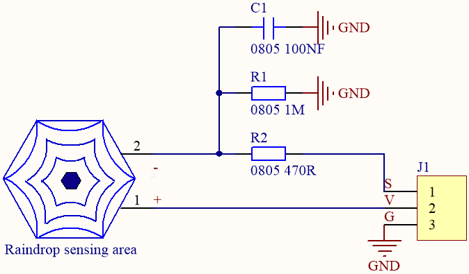
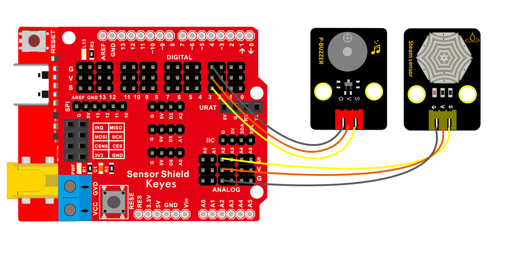
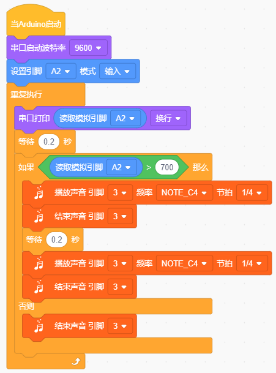
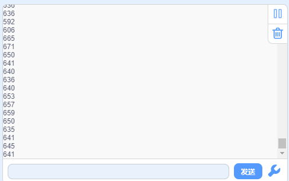

### 项目十 水滴警报

1.项目介绍

这是一个常用的水滴水蒸气传感器。它的原理是通过电路板上裸露的金属花纹区检测水量的大小。水量越多，就会有更多的导线被联通，随着导电的接触面积增大，输出的电压就会逐步上升。除了可以检测水量的大小，它还可以检测空气中的水蒸气。即：水滴传感器是一种模拟传感器，可以作为一个简单的雨水探测器和液位开关。当传感器表面的湿度升高时，输出电压将升高，读取到的模拟值即增大。

该传感器兼容各种单片机控制板，如Arduino系列单片机。实验中，将传感器信号端输入到开发板的模拟口，感知模拟值的变化，并在串口监视器上显示出对应的模拟值，当数值达到某一数值时控制蜂鸣器发声。

2.模块相关资料

| 工作电压     | DC 3.3-5V                                |
| ------------ | ---------------------------------------- |
| 工作温度范围 | －10℃～＋70℃                             |
| 最大工作电流 | 5uA (DC5V，或者当水滴传感器两脚直接短接) |
| 控制接口     | 模拟输出                                 |

3.实验组件

| 控制板 * 1                               | 扩展板 * 1                               | 无源蜂鸣器模块                           | 水滴水蒸气传感器模块* 1                  | 3P 转杜邦线母*2                          |
| ---------------------------------------- | ---------------------------------------- | ---------------------------------------- | ---------------------------------------- | ---------------------------------------- |
|  |  |  |  |  |

4.模块接线图

5.实验代码

6.实验结果

上传好测试程序，打开Arduino智能家居的电源开关，打开串口显示窗口，设置波特率为9600，我们看到在串口显示器中打印水滴传感器测到的湿度模拟值，传感器表面的湿度升高时，输出电压将升高，读取到的模拟值即增大，当大于700时，无源蜂鸣器发声警报。

7.代码说明

①.......初始化
②.......波特率设置为9600
③......A2设为输入
④......串口显示水滴传感器的数据
⑤......延时200mS
⑥......如果数值大于等于700，无源蜂鸣器发出滴滴声
⑦......否则停止发声