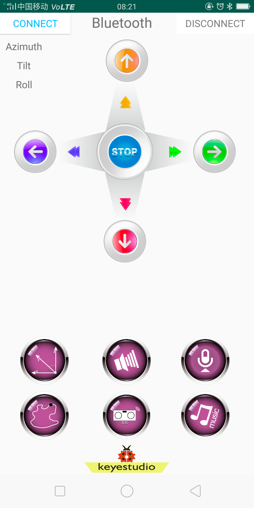

### 项目十六 蓝牙控制LED灯

1.项目介绍

DX-BT24 5.1蓝牙模块是为智能无线数据传输而打造，采用英国DAILOG公司14531芯片，配置256Kb 空间，遵循V5.1 BLE蓝牙规范。支持AT指令，用户可根据需要更改串口波特率、设备名称等参数，使用灵活。本模块支持UART接口，并支持蓝牙串口透传，具有成本低、体积小、功耗低、收发灵敏性高等优点，只需配备少许的外围元件就能实现其强大功能。

在实验中，我们默认为把蓝牙模块当做从机，手机当做主机。实验中我们在手机上安装对应的APP，在APP上连接蓝牙模块，然后通过手机APP控制智能家居的各元器件实现相应的功能和效果。为此我们还特别设计了分别支持安卓系统和mac系统的手机APP。

2.模块相关资料

（1）参数

- 蓝牙协议：Bluetooth Specification V5.1 BLE

- 工作距离：在开放环境中，实现40m超远距离通讯

- 工作频率：2.4GHz ISM频段

- 通信接口：UART

- 蓝牙认证：符合FCC CE ROHS REACH认证标准

- 串口参数：9600、8数据位、1停止位、无效位、无流控

- 电源：5V DC

- 工作温度：–10至+65摄氏度

（2）应用领域

DX-BT24 模块同时支持 BT5.1 BLE 协议，可以同具备 BLE 蓝牙功能的 iOS设备直接连接，支持后台程序常驻运行。主要用于短距离的数据无线传输领域。避免繁琐的线缆连接，能直接替代串口线。

BT24 模块成功应用领域：

- 蓝牙无线数据传输； 
- 手机、电脑周边设备； 
- 手持 POS 设备；
- 医疗设备无线数据传输； 
- 智能家居控制； 
- 蓝牙打印机；
- 蓝牙遥控玩具； 
- 共享单车；

（3）接口说明

①STATE：状态脚

②RX：接收脚

③TX：发送脚

④GND：接地脚

⑤VCC：电源脚

⑥EN：使能脚

3.实验组件

| 控制板 * 1                               | 扩展板 * 1                               | LED模块* 1                               | BT-24蓝牙 *1                             | 3P 转杜邦线母 *1                         |
| ---------------------------------------- | ---------------------------------------- | ---------------------------------------- | ---------------------------------------- | ---------------------------------------- |
|  |  |  |  |  |
|                                          |                                          |                                          |                                          |                                          |

4.模块接线图

5.实验代码

拖动代码块编写程序：

寻找代码块

完整的代码

特别注意：在上传测试代码时，不能连接蓝牙模块，需要把蓝牙模块取下，否则程序上传不成功。先上传测试代码，成功后再连接蓝牙和蓝牙模块，配对，连接APP。

6. APP下载和简介

（1）安卓系统手机蓝牙APP（国内）：

下载链接：http://8.210.52.206/keyes-IoT.apk

二维码下载：

下载安装后打开

出现如下图界面。

控制板上传代码成功后，连接蓝牙，上电后，蓝牙模块上LED闪烁。开启手机蓝牙，点击左上角的SCANING按钮，进行蓝牙搜索和连接。

点击连接，蓝牙BT24连接成功，显示如下图，蓝牙模块上的LED变为常亮。

（2）苹果系统手机（平板电脑）APP

打开App Store。

在APP Store上搜索IoT keyes，点击获取，下载安装APP即可。

下载安装后打开

出现如下图界面。

点击Connect，再点击BT24就可以连接上蓝牙了,此时蓝牙的红色指示灯为常亮。

在APP中有16个控制按键，当手机APP成功连接上BT-24蓝牙后，我们按下APP控制按键，每按下一个APP上的按键蓝牙发送一个控制字符，蓝牙模块就能接收到一个对应的控制字符，我们在编程时，根据对应按键控制字符设置智能家居各传感器或模块的对应功能。在这个实验中，我们先测试出16个按键对应的控制字符。

实验结果

上传好测试程序，如上打开APP连接上蓝牙，点击一下点亮黄色LED灯，再点击一下熄灭LED灯。打开串口监视器，设置波特率为9600。按下手机APP上功能按钮，我们可以看到APP上功能按钮对应的控制字符，如下图：

经过测试，我们得出了手机APP上各个按钮对应的控制字符和各个按钮对应的功能，这里我们整理了一个表格如下：**（说明：下图是安卓手机的APP一些操作说明界面（ios的界面基本一样））**。

按钮:
功能：配对连接HM-10蓝牙模块
按钮:

功能：断开蓝牙连接

按钮:点一下发送 “a”；再点一下发送“b”。

按钮:控制字符：点一下发送 “c”；再点一下发送“d”。

按钮:控制字符：按住发送 “e”；松开发送“g”。

按钮:控制字符：按住发送 “f”；松开发送“g”。

按钮:控制字符：点一下发送 “h”；再点一下发送“S”。

按钮:控制字符：点一下发送 “i”；再点一下发送“S”。

按钮:点一下发送 “j”；再点一下发送“S”。

按钮:控制字符：点一下发送 “k”；再点一下发送“S”。

按钮:控制字符：点一下发送 “l”；再点一下发送“m”。

拖动条:控制字符：拖动拖动条松开时发送“t 50#”，字符‘t’表示起始字符；数字50表示舵机1的角度；字符‘#’表示终止字符。

按钮:控制字符：点一下发送 “n”；再点一下发送“o”。

拖动条:控制字符：拖动拖动条松开时发送“u 34#”，字符‘u’表示起始字符；数字34表示舵机2的角度；字符‘#’表示终止字符。

按钮:控制字符：点一下发送 “p”；再点一下发送“q”。

拖动条:控制字符：拖动拖动条松开时发送“v 100#”，字符‘v’表示起始字符；数字100表示led2的PWM值；字符‘#’表示终止字符。

按钮:控制字符：点一下发送 “r”；再点一下发送“s”。

拖动条:控制字符：拖动拖动条松开时发送“w 153#”，字符‘w’表示起始字符；数字153表示小风扇的PWM值；字符‘#’表示终止字符。