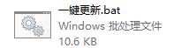
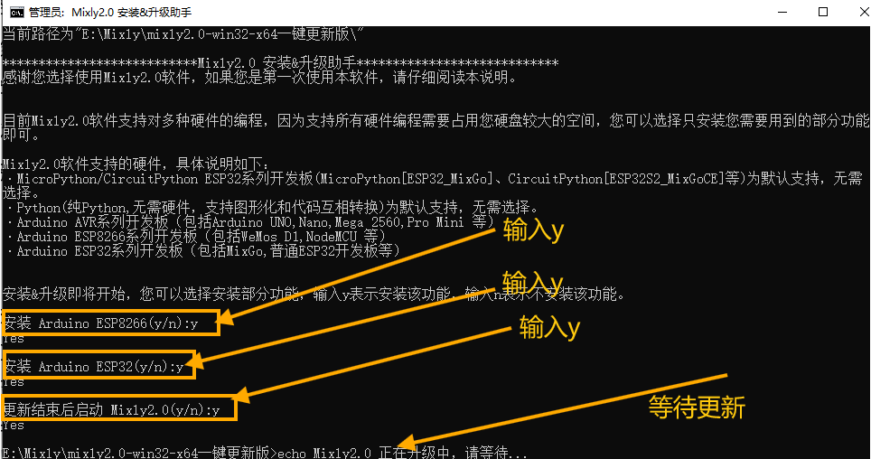
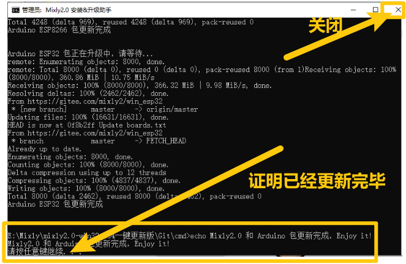
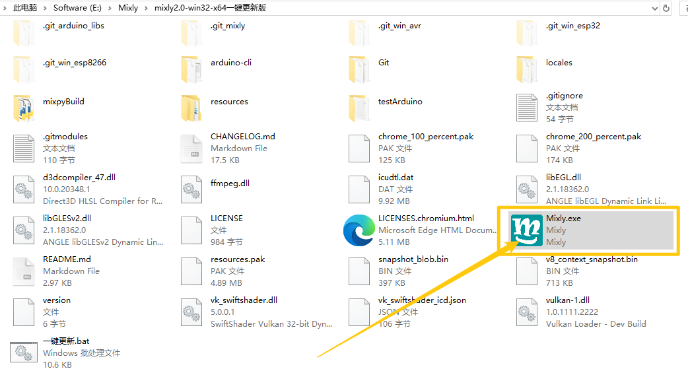
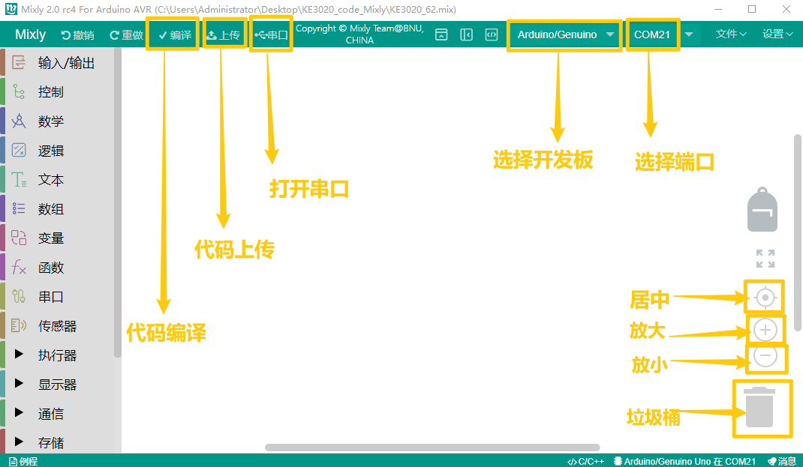
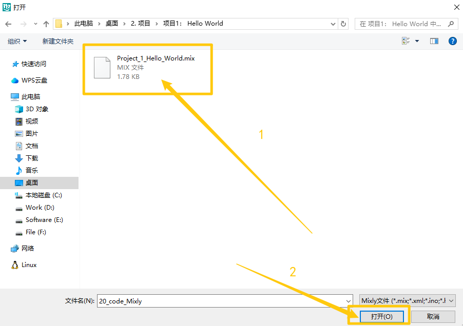
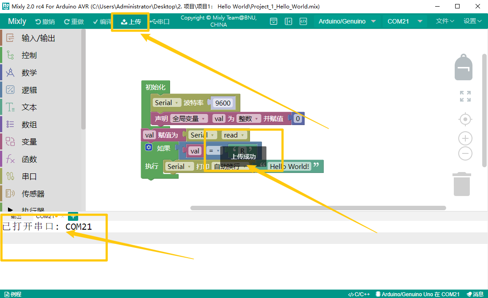

# 6. Mixly软件下载与配置

## 6.1 资料下载

**以下Mixly资料链接含库文件和项目代码、软件等资源，请先点击下载进行后续的学习！！！！**

链接下载（百度网盘）： https://pan.baidu.com/s/1tJiKGUYVtE4VZKwZhCoy2w?pwd=jvmg

代码和库文件下载：[Mixly](./Mixly.7z)

APP下载：[APP](./APP.7z)

## 6.2 软件安装

1. 下载压缩包，压缩包存放路径不要有中文

2. 解压压缩包，打开文件夹，打开。

3. 需要输入的地方全部输入“y”，等待更新即可。（对于ESP8266和ESP32请自行决定是否安装，如果不确认全部输入“Y"即可

4. 更新完毕后，关闭。

   

5.再次打开文件夹，可以看到软件已存在，点击打开。

## 6.3 软件介绍

1. 打开软件后，选择“Arduino AVR”.

2. 工具栏介绍

   

## 6.4 导入库文件

1. 点击“设置”---->“管理库”

   

   

2.选择本地导入，再选择所需的库文件，选择库文件中的“.xml”后缀的文件导入。

## 6.5 上传代码文件

1. 点击“文件”---->“打开”

2. 找到代码保存的位置，选择“.mix”文件，点击“确定”

3. 点击“上传”。

   

