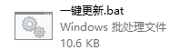
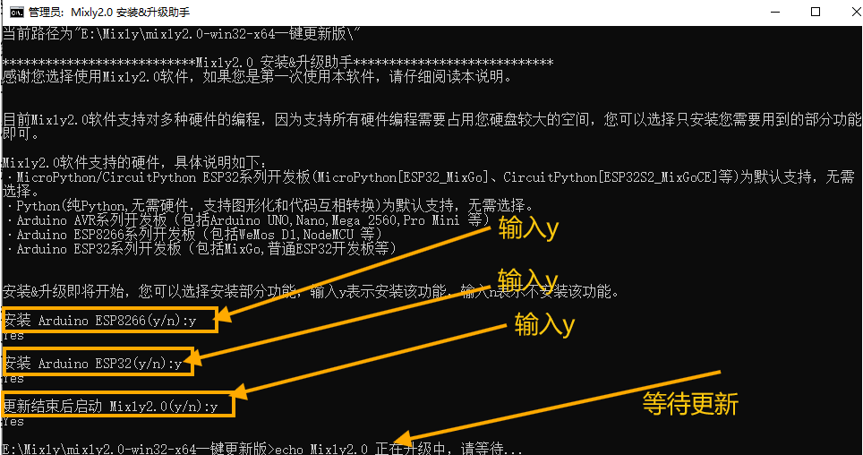
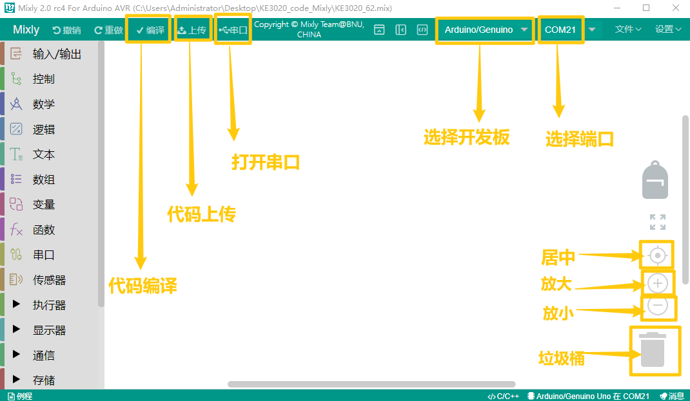

6. Mixly软件下载与配置
======================

6.1 资料下载
------------

\ **以下Mixly资料链接含库文件和项目代码、软件等资源，请先点击下载进行后续的学习！！！！**\ 

链接下载（百度网盘）：
https://pan.baidu.com/s/1tJiKGUYVtE4VZKwZhCoy2w?pwd=jvmg

代码和库文件下载：  :download:`Mixly <./Mixly.7z>`

APP下载： :download:`APP <./APP.7z>`

6.2 软件安装
------------

1. 下载压缩包，压缩包存放路径不要有中文

|image1|

2. 解压压缩包，打开文件夹，打开\ |image2|\ 。

3. 需要输入的地方全部输入“y”，等待更新即可。（对于ESP8266和ESP32请自行决定是否安装，如果不确认全部输入“Y”即可

|image3|

4. 更新完毕后，关闭。

   |image4|

5.再次打开文件夹，可以看到软件已存在，点击打开。

|image5|

6.3 软件介绍
------------

1. 打开软件后，选择“Arduino AVR”.

.. figure:: ./media/image-20250610144229368.png
   :alt: image-20250610144229368

2. 工具栏介绍

   |image6|

6.4 导入库文件
--------------

1. 点击“设置”—->“管理库”

   |image7|

2.选择本地导入，再选择所需的库文件，选择库文件中的“.xml”后缀的文件导入。

|image8|

6.5 上传代码文件
----------------

1. 点击“文件”—->“打开”

|image9|

2. 找到代码保存的位置，选择“.mix”文件，点击“确定”

|image10|

3. 点击“上传”。

   .. figure:: ./media/image-20250610151751682.png
      :alt: image-20250610151751682

.. |image1| image:: ./media/image-20250610134847834.png

.. |image4| image:: ./media/image-20250610141058386.png
.. |image5| image:: ./media/image-20250610144118850.png

.. |image7| image:: ./media/image-20250610150044409.png
.. |image8| image:: ./media/image-20250610150604640.png
.. |image9| image:: ./media/image-20250610151244614.png
.. |image10| image:: ./media/image-20250610151446877.png

6.5 项目课程
-------------------

.. toctree::
    :maxdepth: 1

    Project/项目一
    Project/项目二
    Project/项目三
    Project/项目四
    Project/项目五
    Project/项目六
    Project/项目七
    Project/项目八 
    Project/项目九 
    Project/项目十
    Project/项目十一
    Project/项目十二
    Project/项目十三
    Project/项目十四 
    Project/项目十五 
    Project/项目十六 
    Project/项目十七