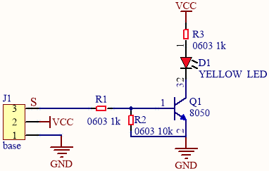
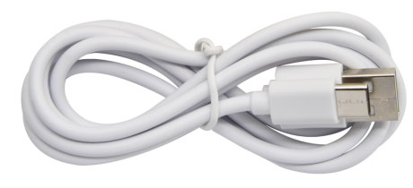

### 项目一 LED闪烁

1.项目介绍

前面我们已经组装好了智能家居。接下来的项目我们就要由简单到复杂，一步一步探索Mixly的世界了。LED，即发光二极管的简称。由含镓（Ga）、砷（As）、磷（P）、氮（N）等的[化合物](https://baike.baidu.com/item/%E5%8C%96%E5%90%88%E7%89%A9/1142931)制成。当电子与[空穴](https://baike.baidu.com/item/%E7%A9%BA%E7%A9%B4/3517781)复合时能辐射出可见光，因而可以用来制成发光二极管。在电路及仪器中作为指示灯，或者组成文字或数字显示。砷化镓二极管发红光，磷化镓二极管发绿光，碳化硅二极管发黄光，氮化镓二极管发蓝光。因化学性质又分有机发光二极管OLED和无机发光二极管LED。

为了实验的方便，我们将LED发光二极管做成了一个LED模块，在这个项目中，我们用一个最基本的测试代码来控制LED，亮一秒钟，灭一秒钟，来实现闪烁的效果。你可以改变代码中LED灯亮灭的时间，实现不同的闪烁效果。LED模块信号端S为高电平时LED亮起，S为低电平时LED熄灭。

2.模块相关资料

| 工作电压:     | DC 3.3-5V          |
| ------------- | ------------------ |
| 工作电流：    | &lt; 20mA          |
| 最大功率：    | 0.1W               |
| 控制接口:     | 数字口（数字输入） |
| 工作温度：    | -10°C ~ +50°C      |
| LED显示颜色： | 黄色               |

3.实验组件

| 控制板 * 1                               | 扩展板 * 1                               | USB线 *1                                 | LED模块                                  | 3P 转杜邦线母 *1                         |
| ---------------------------------------- | ---------------------------------------- | ---------------------------------------- | ---------------------------------------- | ---------------------------------------- |
|  |  |  |  |  |

4.模块接线图

注意：这里体现的是实验使用到的模块接线图，若前面已经组装好智能家居并不用拆掉

5.实验程序

通过拖动代码块来编写代码程序，操作步骤如下：

①点击左侧基本块区，在**控制**栏目里面拖出初始化图标

②点击**输入/输出**栏，拖出**数字输出**代码块，放入初始化里面，设置管脚为5，电平为低，关闭LED。

③再单独复制一个**数字输出**代码块，设置管脚为5，电平为高，点亮LED

④在**控制**栏目里拖出延时模块，设置为1000毫秒

⑤再复制一个**数字输出**代码块，设置管脚为5，电平为低，熄灭LED

⑥再来一个延时1000毫秒

完整的代码如下

6.实验结果

将再将船型开关上的“1”端按下，同时黄色LED亮1000毫秒，灭1000毫秒，循环交替。

7.代码说明

|  | 设置引脚5输出高电平 |
| ---------------------------------------- | ------------------- |
|  | 设置引脚5输出低电平 |
|  | 延时1000毫秒        |

