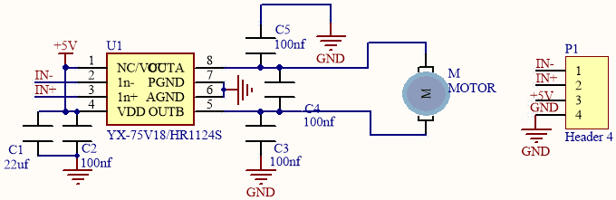
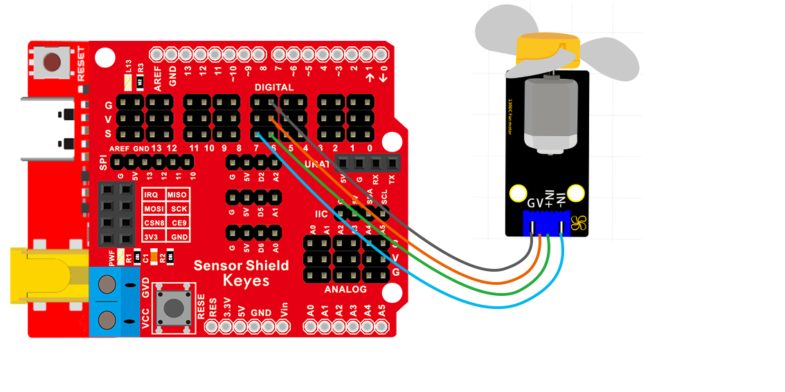
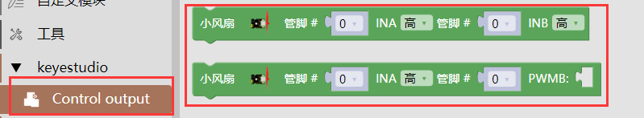
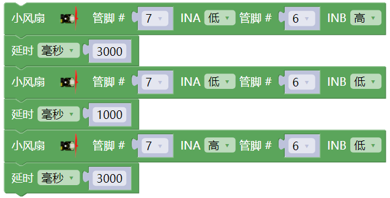
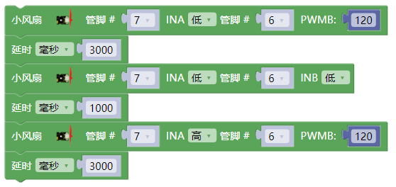

### 项目八 小风扇转动

1.项目介绍

130电机控制模块采用HR1124S电机控制芯片。HR1124S是应用于直流电机方案的单通道H桥驱动器芯片。HR1124S的H桥驱动部分采用低导通电阻的PMOS和NMOS功率管。低导通电阻保证芯片低的功率损耗，使得芯片安全工作更长时间。此外HR1124S拥有低待机电流，低静态工作电流，这些性能使HR1124S易用于玩具方案。

该模块兼容各种单片机控制板，如arduino系列单片机。模块上自带的防反插红色端子间距为2.54mm，实验中，我们可通过输出到两个信号端IN+和IN-的电压方向来控制电机的转动方向，让电机转动起来。

2.模块相关资料

- 工作电压：  3.3-5V(DC)

- 最大电流：  200mA (DC5V)

- 最大功率：  1W

- 控制接口：  双数字口（数字输入

- 工作温度：  -10°C ~+50°C

- 环保属性：ROHS

3.实验组件

| 控制板 * 1                               | 扩展板 * 1                               | USB线 * 1                                | Keyes DIY电子积木 130电机模块* 1         | 4P 转杜邦线母*1                          |
| ---------------------------------------- | ---------------------------------------- | ---------------------------------------- | ---------------------------------------- | ---------------------------------------- |
|  |  |  |  |  |

4.模块接线图

5.实验代码

拖动代码块编写程序：

寻找代码块

完整的代码如下

6.实验结果

烧录好测试程序，打开电源开关后，风扇顺时针转动3秒；停止1秒；逆时针转动3秒；循环交替。

7.实验扩展

修改的数值就可以改变小风扇的转速了（0~255）;

8.代码说明

将管脚设置为6、7，当6输出为低电平即INA输入低电平，7输出为高电平即INB输入高电平时（输入与输出是相对的，这个实验中对于我们单片机的引脚来说，单片机输出高低电平，自然模块就为输入了，即从单片机输出到模块；例如按键模块则相反，是模块输出到单片机），电机顺时针旋转；当6输出为高电平，7输出为低电平时，电机逆时针旋转；当两个管脚都设置为低电平时，电机停止转动。