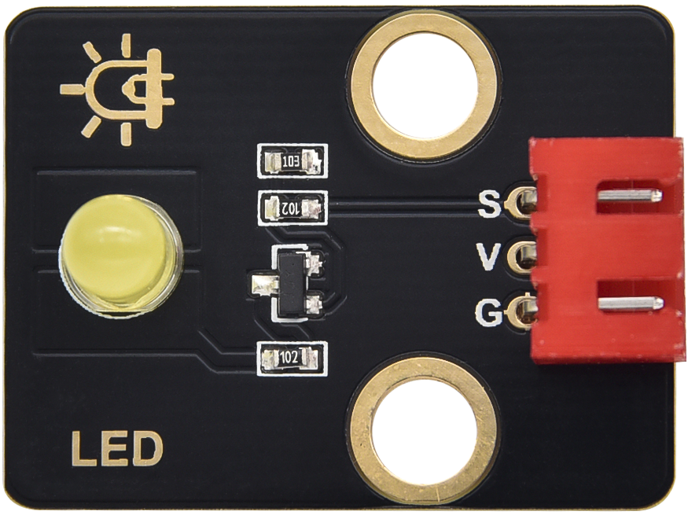
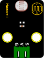
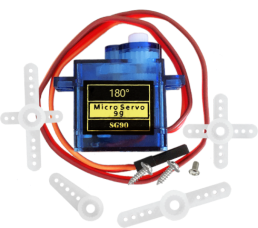
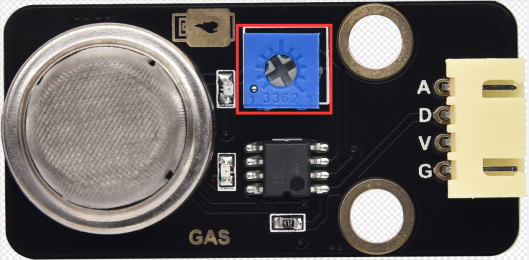
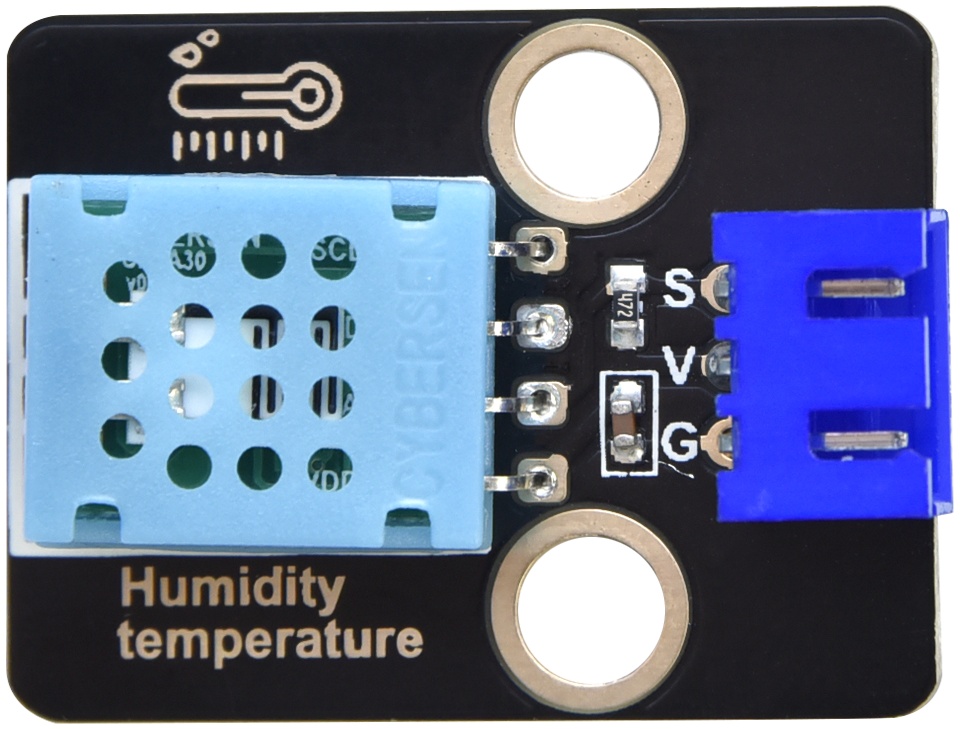
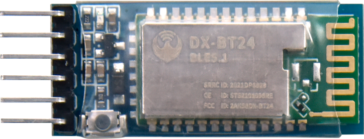
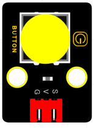
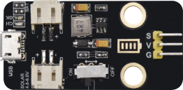
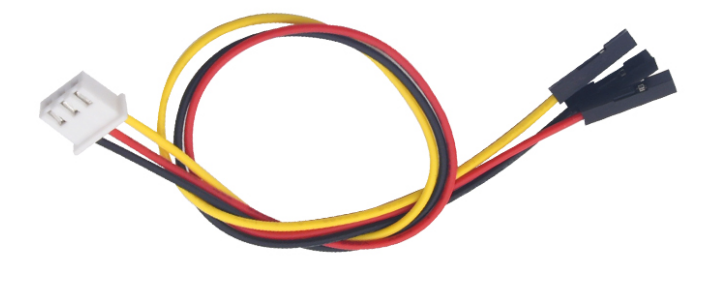
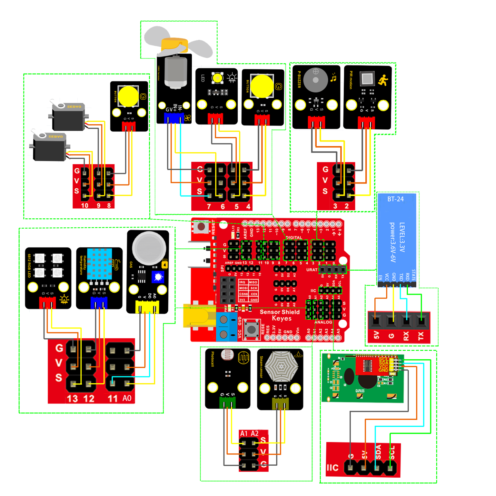

### 项目十七 智能家居完整版课程

1.项目介绍

前面已经安装了智能家居套件的结构部分和学习了各传感器和模块的使用方法，在最后这个综合的实验中，我们来实现智能家居的所有功能。

2.实验主要组件

| 控制板 * 1                               | 扩展板 * 1                               | USB线*1                                  | LED模块                                  | 6812模块                                 |
| ---------------------------------------- | ---------------------------------------- | ---------------------------------------- | ---------------------------------------- | ---------------------------------------- |
|  |  |  |  |  |
| 无源蜂鸣器模块                           | Keyes 光敏电阻传感器*1                   | Keyes130电机模块*1                       | 180度舵机*2                              | Keyes水滴水蒸气传感器模块*1              |
|  |  |  |  |  |
| Keyes人体红外热释传感器*1                | KeyesMQ2传感器*1                         | KeyesXHT11传感器*1                       | Keyes LCD1602模块* 1                     | BT-24蓝牙*1                              |
|  |  |  |  |  |
| Keyes按键*2                              | 充电模块*1                               | 3P 转杜邦线母若干*1                      | 4P 转杜邦线母若干                        |                                          |
|  |  |  |  |                                          |

3.接线图

| 传感器模块名称     | 传感器模块引脚与传感器扩展板对应的接线 | 在椴木板上所处的对应位置 |
| ------------------ | -------------------------------------- | ------------------------ |
| 人体红外传感器模块 | G/V/S                                  | G/V/2                    |
| 无源蜂鸣器模块     | G/V/S                                  | G/V/3                    |
| 按键传感器模块1    | G/V/S                                  | G/V/4                    |
| 黄色LED模块        | G/V/S                                  | G/V/5                    |
| 小风扇模块         | GND/VCC/IN+/IN-                        | G/V/6/7                  |
| 按键传感器模块2    | G/V/S                                  | G/V/8                    |
| 控制门的舵机1      | 棕色线/红色线/橙色线                   | G/V/9                    |
| 控制窗的舵机2      | 棕色线/红色线/橙色线                   | G/V/10                   |
| MQ-2烟雾传感器模块 | GND/VCC/D0/A0                          | G/V/11/A0                |
| XHT11模块          | G/V/S                                  | G/V/12                   |
| GRB灯模块          | G/V/S                                  | G/V/13                   |
| LCD1602显示屏模块  | GND/VCC/SDA/SCL                        | GND/5V/SDA/SCL           |
| 光敏传感器模块     | G/V/S                                  | G/V/A1                   |
| 水蒸气传感器模块   | G/V/S                                  | G/V/A2                   |
| BT-24蓝牙模块      | 5V/G/RX/TX                             | VCC/GND/TX/RX            |

4.流程图

5.实验程序

由于程序比较大，这里就不贴出来了，请打开我们提供的程序查看。

6.代码说明

(1)在上传代码时，不能连接蓝牙模块，需要把蓝牙模块取下，否则整个程序代码上传不成功。

上传测试代码成功后再插上蓝牙模块，配对，连接APP。

（2）APP的下载和使用参考**第16课**

7.实验结果

组装好智能家居，上传好上面的实验程序，太阳能电源板的开关拨到ON位置，按下船型开关的1,打开手机APP连接好蓝牙，按下APP的功能按键就可以控制智能家居了，功能如下：

（1）

| 按钮：               | 功能：配对连接BT-24蓝牙模块                                  |                                                              |
| ------------------------------------------------------------ | ------------------------------------------------------------ | ------------------------------------------------------------ |
| 按钮:                | 功能：断开蓝牙连接                                           |                                                              |
| 按钮:                | 控制字符：点一下发送 “a”； 再点一下发送“b”。                 | 功能：点一下，开启门前的RGB灯；再点一下，关闭门前的RGB灯。   |
| 按钮:                | 控制字符：点一下发送 “c”； 再点一下发送“d”。                 | 功能：点一下，LCD屏显示温湿度； 再点一下，进入输入密码开锁模式。 |
| 按钮:                | 控制字符：按住发送 “e”； 松开发送“g”。                       | 功能：点一下，播放一次生日快乐歌曲。                         |
| 按钮:                | 控制字符：按住发送 “f”； 松开发送“g”。                       | 功能：点一下，播放一首欢乐颂音乐                             |
| 按钮:                | 控制字符：点一下发送 “h”； 再点一下发送“S”。                 | 功能：点一下，开始接收光敏传感器检测到的数据，light处显示检测到的数据； 再点一下，关闭光敏传感器。 |
| 按钮:                | 控制字符：点一下发送 “i”； 再点一下发送“S”。                 | 功能：点一下，开始接收气体传感器检测到的数据，gas处显示检测到的数据； 再点一下，关闭气体传感器。 |
| 按钮:                | 控制字符：点一下发送 “j”； 再点一下发送“S”。                 |                                                              |
| 按钮:                | 控制字符：点一下发送 “k”； 再点一下发送“S”。                 | 功能：点一下，开始接收水蒸气传感器检测到的数据，water处显示检测到的数据； 再点一下，关闭水蒸气传感器。 |
| 按钮:                | 控制字符：点一下发送 “l”； 再点一下发送“m”。                 | 功能：点一下，开启门； 再点一下，关闭门。                    |
| 拖动条:  | 控制字符：拖动拖动条松开时发送“t 50#”，字符‘t’表示起始字符；数字50表示舵机1的角度；字符‘#’表示终止字符。 | 功能：拖动条，控制门的转动大小，就是控制舵机1的角度，door处显示拖动条对应的值。 |
| 按钮:                | 控制字符：点一下发送 “n”； 再点一下发送“o”。                 | 功能：点一下，开启窗户； 再点一下，关闭窗户。                |
| 拖动条:              | 控制字符：拖动拖动条松开时发送“u 34#”，字符‘u’表示起始字符；数字34表示舵机2的角度；字符‘#’表示终止字符。 | 功能：拖动条，控制窗户的转动大小，就是控制舵机2的角度，win处显示拖动条对应的值。 |
| 按钮:                | 控制字符：点一下发送 “p”； 再点一下发送“q”。                 | 功能：点一下，开启室内LED； 再点一下，关闭室内LED。          |
| 拖动条:              | 控制字符：拖动拖动条松开时发送“v 100#”，字符‘v’表示起始字符；数字100表示led2的PWM值；字符‘#’表示终止字符。 | 功能：拖动条，控制室内LED的亮度，led2处显示拖动条对应的PWM值。 |
| 按钮:                | 控制字符：点一下发送 “r”； 再点一下发送“s”。                 | 功能：点一下，开启小风扇； 再点一下，关闭小风扇。            |
| 拖动条:              | 控制字符：拖动拖动条松开时发送“w 153#”，字符‘w’表示起始字符；数字153表示小风扇的PWM值；字符‘#’表示终止字符。 | 功能：拖动条，控制小风扇的转速，fans处显示拖动条对应的PWM值。 |

（2）煤气警报：当MQ2气体传感器检测到煤气泄漏时（数值\>700，这里可以用打火机气体测试）,蜂鸣器发声警报，小于100时停止发声。

（3）下雨关窗：当水滴滴传感器检测数据大于800时，接在引脚10的舵机转动120度关窗，否则转到零度。

（4）天黑开灯：当光敏传感器检测数据小于300并且人体红外传感器检测到有人时，RGB灯亮红色；否则熄灭RGB灯（注：数据小于300的条件下）。

（5）输入密码开门：门上有1602LCD显示屏、两个按钮、舵机1，按按钮1输入密码，正确密码是:**. - - . - .****(”.”的意思是点击按钮，” -”的意思是长按按钮2S以上)**输入一位显示屏就显示一个“\*”号，密码输入完成，按下按钮2，如果密码正确，显示屏显示open，舵机1转到100度，开门，5秒之后，人体红外传感器检测到没人时就会自动关门。如果密码错误，显示屏显示error，两秒后显示again之后可重新输入密码。还可以长按，按钮2，蜂鸣器会响，相当于门铃。