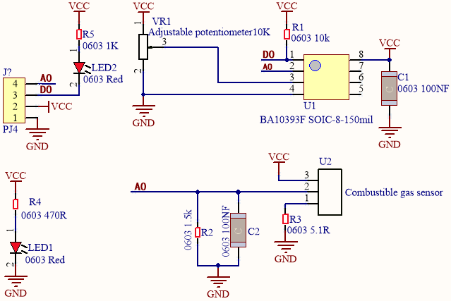
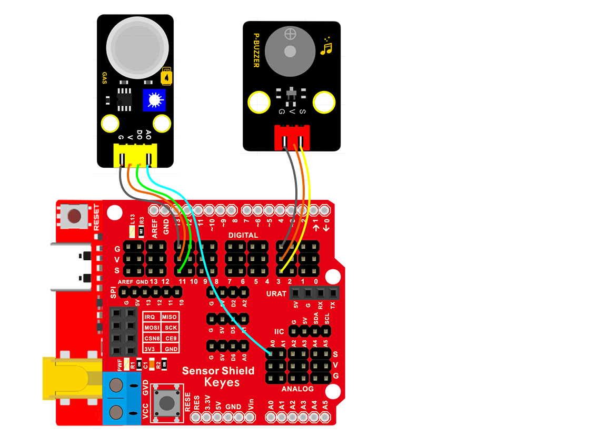
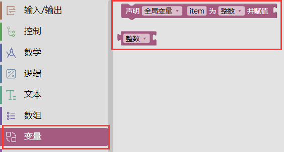
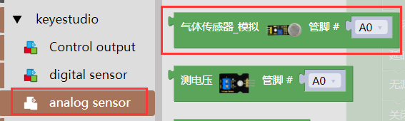
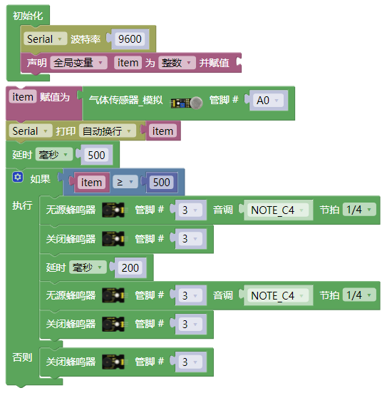

### 项目十二 MQ2模拟气体传感器实验

1.项目介绍

气体传感器（MQ-2）可用于家庭用气体泄漏报警器、工业用可燃气体报警器以及便携式气体检测仪器，适宜于液化气、苯、烷、酒精、氢气、烟雾等的探测，被广泛运用到各种消防报警系统中。故因此，气体传感器（MQ-2）可以准确来说是一个多种气体探测器，同时还具有灵敏度高、响应快、稳定性好、寿命长、驱动电路简单等优点。

气体传感器（MQ-2）检测可燃气体与烟雾的浓度范围是300~10000ppm，对天然气、液化石油气等烟雾有很高的灵敏度，尤其对烷类烟雾更为敏感。在使用之前必须加热一段时间，这样输出的电阻和电压较准确。但是加热电压不宜过高，否则会导致内部的信号线熔断。

模拟气体（MQ-2）传感器属于二氧化锡半导体气敏材料，属于表面离子式N型半导体。处于200~300摄氏度时，二氧化锡吸附空气中的氧，形成氧的负离子吸附，使半导体中的电子密度减少，从而使其电阻值增加。当与空气中可燃气体和烟雾烟雾接触时，如果晶粒间界处的势垒收到烟雾的调至而变化，就会引起表面导电率的变化。利用这一点就可以获得烟雾或可燃气体存在的信息，空气中烟雾或可燃气体的浓度越大，导电率越大，输出电阻越低，则输出的模拟信号就越大。

此外，通过旋转电位器可以调整气体传感器（MQ-2）灵敏度。上电后，传感器上的一个指示灯亮绿灯，并且还可以调节蓝色的正方体电位器，使模块上另一个指示灯介于不亮与亮之间的临界点时，灵敏度最高。

2.模块相关资料

| 工作电压：           | 5V                             |
| -------------------- | ------------------------------ |
| 工作电流：           | 160mA (DC5V)                   |
| 工作温度：           | 0°C ~ 40°C                     |
| 控制接口：           | 数字、模拟输出                 |
| 检测浓度：           | 300-10000ppm(可燃气体)         |
| 浓度斜率：           | ≤0.6(R3000ppm/R1000ppm C3H8)   |
| 灵敏度：             | Rs(in air)/Rs(1000ppm异丁烷)≥5 |
| 敏感体表面电阻（Rs） | 2KΩ-20KΩ(in 2000ppm C3H8 )     |

3.实验组件

| 控制板 * 1                               | 扩展板 * 1                               | MQ2传感器* 1                             |
| ---------------------------------------- | ---------------------------------------- | ---------------------------------------- |
|  |  |  |
| 无源蜂鸣器模块* 1                        | 3P 转杜邦线母* 1                         | 4P 转杜邦线母*1                          |
|  |  |  |

4.模块接线图

5.实验代码

拖动代码块编写程序：

寻找代码块

完整的代码如下

6.实验结果

上传好测试程序，打开Arduino智能家居的电源开关，打开串口显示窗口，设置波特率为9600，我们看到在串口显示器中打印MQ2传感器测到可燃性气体的数据，当大于500时无源蜂鸣器发出滴滴的声音(可以用打火机气体测试)；未检测到可燃性气体时，无源蜂鸣器不发出声音。

