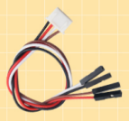
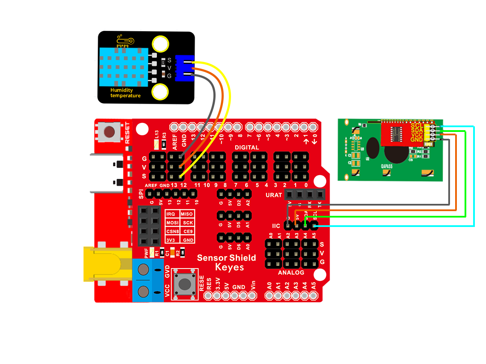

### 项目十五 温湿度仪表

1.项目介绍

在冬季时，空气中的湿度很低，就是空气很干燥，再加上寒冷，人体的皮肤就容易过于干燥而裂，所以需要再用加湿器给家里的空气增加湿度，但是怎么知道空气过于干燥了呢？那就需要检测空气湿度的设备。前面我们已经学习了XHT11温湿度传感器和LCD1602显示器，这节课我们就使用这两者结合做一个实验，让温湿度在LCD1602显示，实现温湿度仪表功能。

2.实验组件

| 控制板 * 1                               | 扩展板 * 1                               | USB线*1                                  | XHT11传感器 *1                           |
| ---------------------------------------- | ---------------------------------------- | ---------------------------------------- | ---------------------------------------- |
|  |  |  |  |
| 3P 转杜邦线母*1                          | Keyes LCD1602模块* 1                     | 4P 转杜邦线母*1                          |                                          |
|  |  |  |                                          |

3.模块接线图

4. 实验代码

拖动代码块编写程序：

寻找代码块（前面介绍过的这里不再重复）

完整的代码如下：

5.实验结果

上传好示例程序，打开Arduino智能家居的电源开关，就可以看到LCD1602显示器第一行显示湿度，第二行显示温度。