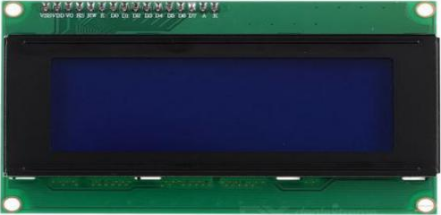

### 项目十四 LCD1602显示

1.项目介绍

Keyes I2C 1602 LCD模块是可以显示2行，每行16个字符的液晶显示器模块。液晶显示器显示蓝底白字，自带I2C通信模块，使用时只需连接单片机I2C通信接口，大大节约了单片机资源。最初的1602 LCD需要7个IO端口来启动和运行，而Keyes I2C 1602 LCD模块内置Arduino IIC/I2C接口，节省了5个IO端口。和Arduino液晶库文件兼容，用起来很简单。

LCD非常适合打印数据和显示数字。可以显示32个字符(16x2)。在Keyes I2C 1602 LCD模块的背面有一个蓝色的电位器，可以转动电位器来调整对比度。**连接时请注意，LCD的GND和VCC不能接反，否则会损坏LCD。**

2.模块相关资料

- 工作电压：DC5V
- 工作电流：< 130mA
- I2C地址：0x27
- 工作环境温度：0°C ~ 45°C（推荐）
- 控制接口：I2C
- 驱动芯片：PCF8574T

| GND              | 一个接地的引脚                           |
| ---------------- | ---------------------------------------- |
| VCC              | 一个连接到+5V电源的引脚                  |
| SDA              | 一个连接到SDA（或A4）的引脚，用于IIC通信 |
| SCL              | 一个连接到SCL（或A5）的引脚，用于IIC通信 |
| 背光（蓝底白字） |                                          |
| 可调对比度       |                                          |

3. 实验组件

| 控制板 * 1                               | 扩展板 * 1                               | Keyes LCD1602模块* 1                     | 4P 转杜邦线母*1                          |
| ---------------------------------------- | ---------------------------------------- | ---------------------------------------- | ---------------------------------------- |
|  |  |  |  |

4.模块接线图

5.实验代码

拖动代码块编写程序：

寻找代码块

完整的代码如下

6.实验结果

上传好程序，打开Arduino智能家居的电源开关,LED1602显示屏第一行显示keyes；第二行显示Hello,world!

7.代码说明

|  | LCD IIC地址为0x27 |
| ---------------------------------------- | ----------------- |
|  | LCD显示内容       |

