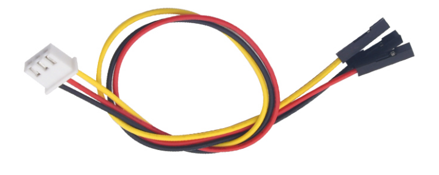
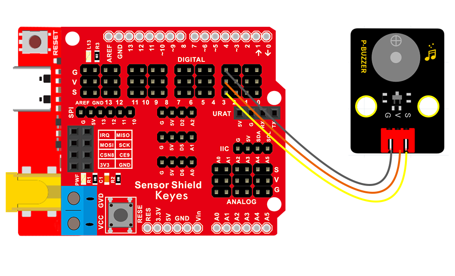

### 项目四 无源蜂鸣器播放音乐

1.项目介绍

本实验用无源蜂鸣器播放音乐，无源蜂鸣器是通过PWM脉冲宽度调制脉冲进而调节音调，PWM比较多用于调节LED灯的亮度或者调节无源蜂鸣器的频率，或者是电机的转动速度，电机带动的车轮速度也就能很容易控制了，在玩一些Arduino机器人时，更能体现PWM的好处。

音乐除了要“唱的准”，还要“节奏对”，每一个音符的持续时间，就是节拍啦。我们可以用延时多少来设置节拍的，例如：1拍，1秒即1000毫秒；1/2拍，0.5秒即500毫秒；1/4拍，0.25秒即250毫秒；1/8拍，0.125秒即125毫秒….，我们可以试一试组合不同的音调和节拍，看看会有什么不同的效果。

2.模块相关资料

- 工作电压：3.3-5V（DC）

- 电流：50MA

- 工作温度：-10摄氏度 到 +50摄氏度

- 尺寸：31.6mmx23.7mm

- 接口：3PIN接口

- 输入信号：数字信号（方波）

3.实验组件

| 控制板 * 1                               | 扩展板 * 1                               | USB线* 1                                 | 无源蜂鸣器模块                           | 3P 转杜邦线母*1                          |
| ---------------------------------------- | ---------------------------------------- | ---------------------------------------- | ---------------------------------------- | ---------------------------------------- |
|  |  |  |  |  |

4.模块接线图

5.实验程序一 

拖动代码块编写程序：

**寻找代码块**

完整的代码如下

6.实验程序二 

7.实验结果

程序一：上传代码到开发板，蜂鸣器就发出do re mi fa so la si do的声音。

程序二：上传程序到开发板，就会听到无源蜂鸣器先播放“欢乐颂”接着“生日快乐”歌曲；

8.代码说明

在音乐中有两个重要的因素：音调和节拍

:表示无源蜂鸣器信号端是接在D3，管脚设置为3，播放音调为NOTE_C4的声音，节拍为1/4拍。音调是由英文和数字组成的音名，选择不同的音名就能改变不同的音调啦。1（Do）、2(Re)、3(Mi)、4(Fa)、5(Sol)、6(La)、7(Si)是音乐当中的唱名，就对应了音调下拉选项中NOTE_C、NOTE_D、NOTE_E、NOTE_F、NOTE_G。

| 1（Do） | 2（Re） | 3(Mi)  | 4(Fa)  | 5(Sol) | 6(La)  | 7(Si)  |
| ------- | ------- | ------ | ------ | ------ | ------ | ------ |
| NOTE_C  | NOTE_D  | NOTE_E | NOTE_F | NOTE_G | NOTE_A | NOTE_B |

比如

从NOTE_C到NOTE_B，音调是越来越高的；同时把音调改成字母相同时，数字越大，音调越高。

音乐除了要“唱的准”，还要“节奏对”，每一个音符的持续时间，就是节拍，数字越大，持续的时间越长。这里的1拍表示持续时间是1000毫秒，1/2拍表示持续时间是500毫秒，3/4拍表示持续时间是750毫秒，1/4拍表示持续时间是250毫秒，依次类推。

