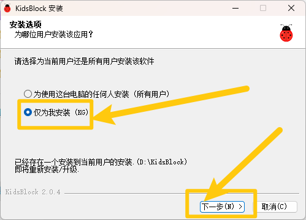
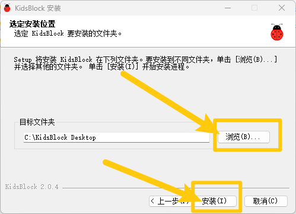
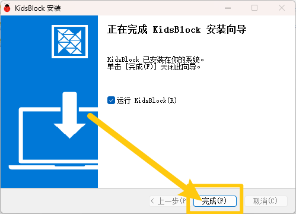
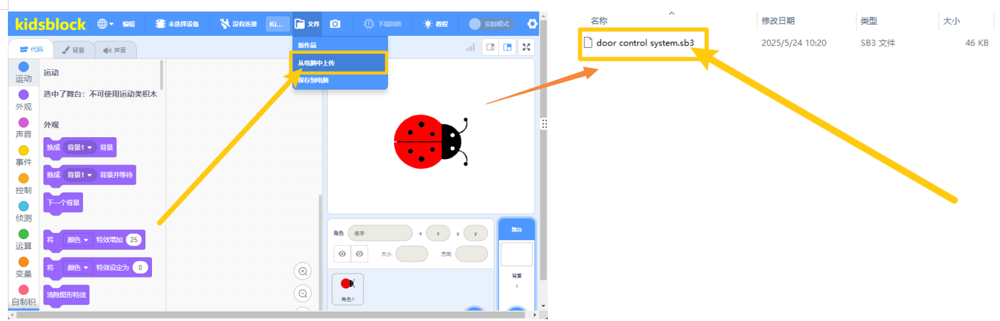
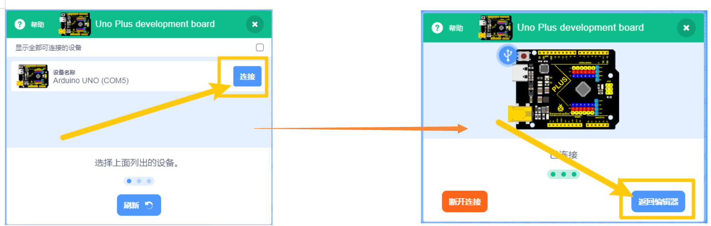

### KidsBlock软件安装说明书–Windows

1. 点击链接 https://xiazai.keyesrobot.cn/KidsBlock.exe下载软件。

2. 双击软件安装包，选择**“仅为我安装”**，选择**“下一步(N)”**。

3. 点击**“浏览（B）”**，可以自定义软件安装的位置，最后选择**“安装（I）”**。

4. 安装完成后，选择**“完成（F）”**。

（首次打开时间稍久，请耐心等待！！！）

### 工具栏介绍

### 加载代码文件（*注意代码和开发板的选择以实物为准,不要完全照下列教程选择*）

⽅法 **1**： 双击教程代码⽂件（.SB3）直接打开。

⽅法 **2**： 点击“⽂件”，选择“从电脑中上传”，选择⽂件（.SB3）即可。

### 代码上传

加载完代码文件后，确保开发板连接到电脑，点击“”以选择对应开发板，点击选择正确的端⼝，显示端口证明已连接。

点击“上传”，上传成功等待代码上传完成后会显示“上传成功”。

**至此，软件已经安装成功，并且可以正常运行，如遇问题请先重新对照教程仔细检查，多次检查后如未解决请联系客服！！！**
