Arduino IDE 开发环境设置
========================

**特别提醒： 本教程采用的 Arduino IDE 版本是
2.3.6。其他版本可参照本教程接合不同版本实际操作，操作中如遇与本教程偏差部分可自行查询。**

一、Arduino IDE下载与安装
-------------------------

电脑打开任意浏览器输入本网址（https://www.arduino.cc/en/software）进入官方下载网页[注意：windows、Mac(苹果系统）、Liunx操作一致，不能使用手机，平板等进行本软件安装]。

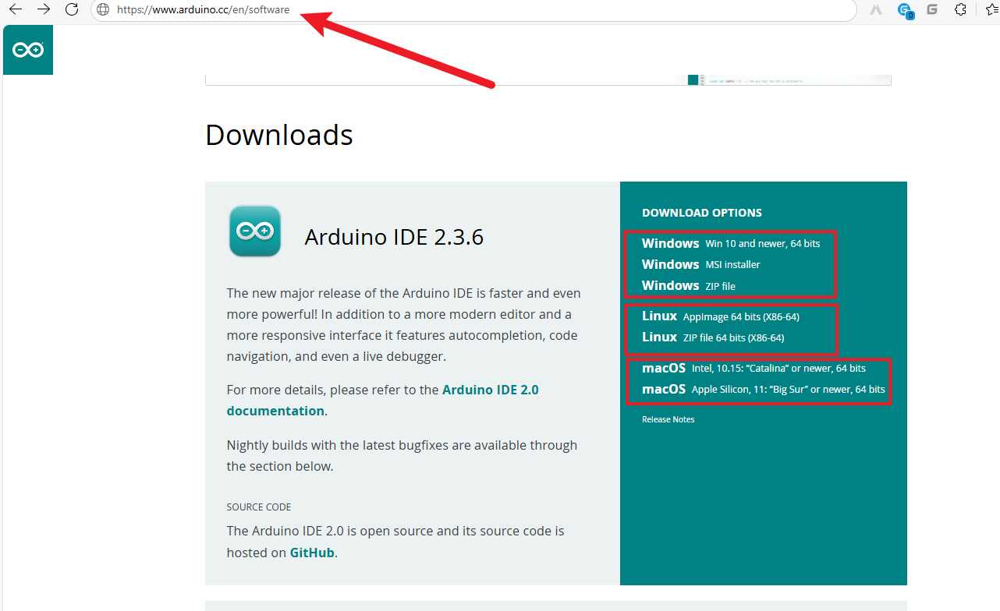

进入界面选择对应系统的软件下载，软件格式可自行选择。

windows系统
~~~~~~~~~~~

.. figure:: media/2.gif
   :alt: A-1751437526749-2

MAC系统
~~~~~~~

.. figure:: media/3.gif
   :alt: f

Linux 系统
~~~~~~~~~~

.. figure:: media/4.png
   :alt: image-20250704104545850

关于在 Linux 系统上安装 Arduino IDE 2
的教程，请参考：\ https://docs.arduino.cc/software/ide-v2/tutorials/getting-started/ide-v2-downloading-and-installing/#linux

Arduino IDE界面介绍
~~~~~~~~~~~~~~~~~~~

|image1|

1.
“文件”：列表里面的功能有新建项目，打开程序，打开最近使用的代码，打开示例代码，关闭IDE，保存代码，首选项，高级设置等。

2.
“编辑”：列表里面的功能有复制，粘贴，自动格式化，字体大小等这个一般都是使用快捷键进行操作。（建议坚持使用快捷键，接触多了就水到渠成了）。

3.
“项目”：列明里面的常用功能有验证:raw-latex:`\编译代码`，上传代码，导入库等。

4. “工具”：列表里面的常用功能有开发板选择，端口选择，这两个很重要。

5. “帮助”：点击这个可以查看IDE版本已经官方的参考文件。

6. “串口绘图仪”：它会将串口的数据以折线图的样式显示出来。

7. “串口监视器”：可以将我们需要查看的数据在这里进行打印显示。

8. 验证程序按钮。

9. 验证并上传程序按钮。

10. “项目文件夹”：可以新建项目，还可以只有arduino Cloud进行同步和编辑。

11. “开发板管理器”：可以添加或删除开发板。

12. “库管理”：就要添加和删除库。

13. “调试”：可以对代码进行监视与断点调试。

14. 搜索框。

15. 代码编辑区。

16. IDE提示区（上传代码报错或成功）和串口监视器显示区

二、驱动检查与安装（以ESP32开发板CH340驱动为例，其他开发板的其他驱动操作一致，均可参照本教程）
----------------------------------------------------------------------------------------------

特别提醒：
一般而言驱动会在电脑连接开发板的时候自动安装，但由于电脑系统设置或者其他原因部分电脑可能无法自动安装驱动，此时需要手动安装。（由于大部分电脑都会自动安装驱动，本部分可以暂时先跳过，在后续教程中若无法识别开发板端口再来阅读本部分）

驱动检查：
~~~~~~~~~~

1、将开发板使用数据线接入电脑

.. figure:: media/6.png
   :alt: a36

2、如下，打开设备管理器后在端口选项识别到了名称为ch340的端口，此时证明驱动安装完成，如果无法确认此端口是否为开发板端口，直接拔掉开发板，断开与电脑的链接，如果端口消失则为开发板端口（注意：端口后出现的COM5为端口号，不同开发板数字可能不同，开发过程中选择实际显示的端口号即可）。

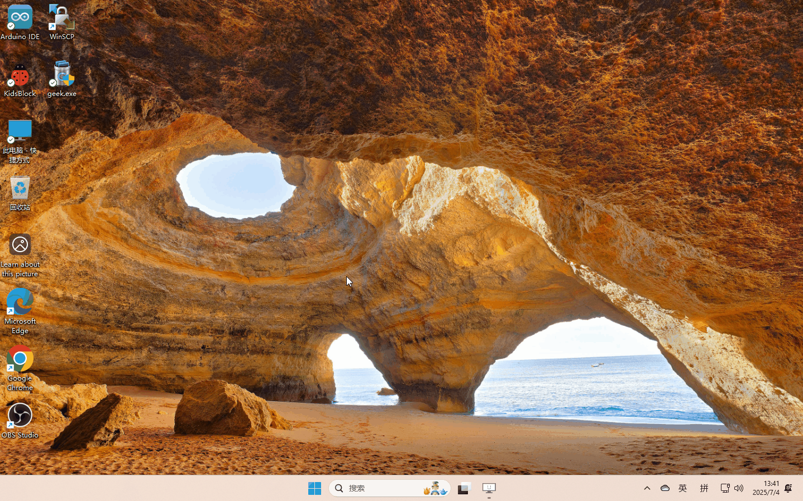

如果出现下图显示则证明驱动没有自动安装（打开端口选项没有新端口出现，在其他设备选项出现了一个带有黄色三角形感叹号的新的设备，设备名以接入开发板实际出现的设备名为准），请继续后续步骤学习

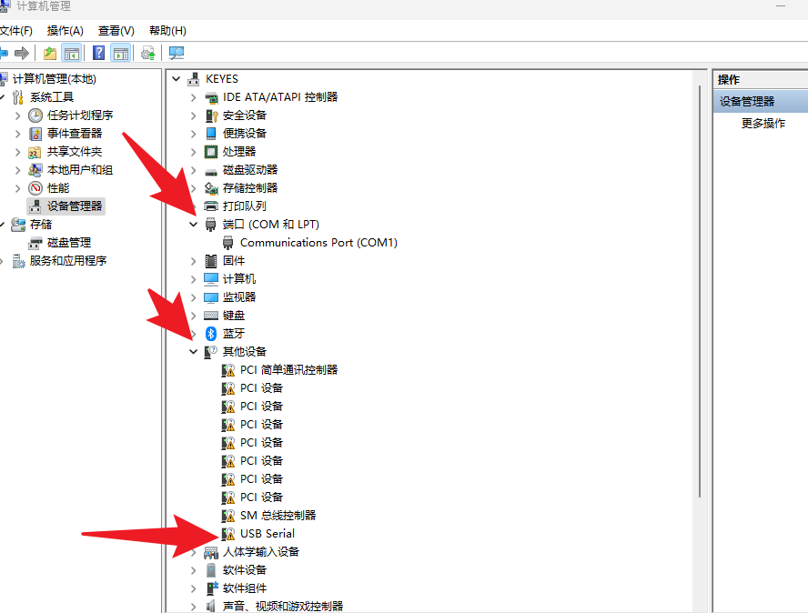

驱动程序安装
~~~~~~~~~~~~

参照下表可以确定产品所使用的驱动（CH340或者CP2102)

+-----+--------+---------------------+------------------------------------------------------------------------------------------------------+----------------------------------------------------------------------------------------------+
| Sku | 开发板 | 图片                | Windows                                                                                              | MAC                                                                                          |
+=====+========+=====================+======================================================================================================+==============================================================================================+
|     |        | |img|               | `CP2102-WINDOWS <https://www.keyesrobot.cn/projects/Arduino/zh-cn/latest/docs/windowsCP2102.html>`__ | `CP2102-MAC <https://www.keyesrobot.cn/projects/Arduino/zh-cn/latest/docs/MacCP2102.html>`__ |
+-----+--------+---------------------+------------------------------------------------------------------------------------------------------+----------------------------------------------------------------------------------------------+
|     |        | |image2|            | `CP2102-WINDOWS <https://www.keyesrobot.cn/projects/Arduino/zh-cn/latest/docs/windowsCP2102.html>`__ | `CP2102-MAC <https://www.keyesrobot.cn/projects/Arduino/zh-cn/latest/docs/MacCP2102.html>`__ |
+-----+--------+---------------------+------------------------------------------------------------------------------------------------------+----------------------------------------------------------------------------------------------+
|     |        | |image3|            | `CP2102-WINDOWS <https://www.keyesrobot.cn/projects/Arduino/zh-cn/latest/docs/windowsCP2102.html>`__ | `CP2102-MAC <https://www.keyesrobot.cn/projects/Arduino/zh-cn/latest/docs/MacCP2102.html>`__ |
+-----+--------+---------------------+------------------------------------------------------------------------------------------------------+----------------------------------------------------------------------------------------------+
|     |        | |image4|            | `CP2102-WINDOWS <https://www.keyesrobot.cn/projects/Arduino/zh-cn/latest/docs/windowsCP2102.html>`__ | `CP2102-MAC <https://www.keyesrobot.cn/projects/Arduino/zh-cn/latest/docs/MacCP2102.html>`__ |
+-----+--------+---------------------+------------------------------------------------------------------------------------------------------+----------------------------------------------------------------------------------------------+
|     |        | |image5|            | `CP2102-WINDOWS <https://www.keyesrobot.cn/projects/Arduino/zh-cn/latest/docs/windowsCP2102.html>`__ | `CP2102-MAC <https://www.keyesrobot.cn/projects/Arduino/zh-cn/latest/docs/MacCP2102.html>`__ |
+-----+--------+---------------------+------------------------------------------------------------------------------------------------------+----------------------------------------------------------------------------------------------+
|     |        | |image6|            | `CH340-WINDOWS <https://www.keyesrobot.cn/projects/Arduino/zh-cn/latest/docs/windowsCH340.html>`__   | `CH340-MAC <https://www.keyesrobot.cn/projects/Arduino/zh-cn/latest/docs/MacCH340.html>`__   |
+-----+--------+---------------------+------------------------------------------------------------------------------------------------------+----------------------------------------------------------------------------------------------+
|     |        | |image7|            | `CH340-WINDOWS <https://www.keyesrobot.cn/projects/Arduino/zh-cn/latest/docs/windowsCH340.html>`__   | `CH340-MAC <https://www.keyesrobot.cn/projects/Arduino/zh-cn/latest/docs/MacCH340.html>`__   |
+-----+--------+---------------------+------------------------------------------------------------------------------------------------------+----------------------------------------------------------------------------------------------+
|     |        | |image8|            | `CP2102-WINDOWS <https://www.keyesrobot.cn/projects/Arduino/zh-cn/latest/docs/windowsCP2102.html>`__ | `CP2102-MAC <https://www.keyesrobot.cn/projects/Arduino/zh-cn/latest/docs/MacCP2102.html>`__ |
+-----+--------+---------------------+------------------------------------------------------------------------------------------------------+----------------------------------------------------------------------------------------------+
|     |        | |image9|            | `CH340-WINDOWS <https://www.keyesrobot.cn/projects/Arduino/zh-cn/latest/docs/windowsCH340.html>`__   | `CH340-MAC <https://www.keyesrobot.cn/projects/Arduino/zh-cn/latest/docs/MacCH340.html>`__   |
+-----+--------+---------------------+------------------------------------------------------------------------------------------------------+----------------------------------------------------------------------------------------------+
|     |        | |image10|           | `CP2102-WINDOWS <https://www.keyesrobot.cn/projects/Arduino/zh-cn/latest/docs/windowsCP2102.html>`__ | `CP2102-MAC <https://www.keyesrobot.cn/projects/Arduino/zh-cn/latest/docs/MacCP2102.html>`__ |
+-----+--------+---------------------+------------------------------------------------------------------------------------------------------+----------------------------------------------------------------------------------------------+

驱动下载：:download:`驱动程序 <./a.7z>`

Windows
^^^^^^^

.. figure:: media/19.gif
   :alt: r

Mac
^^^

.. figure:: media/20.gif
   :alt: 989

至此：电脑已经成功安装驱动程序，此时使用数据线将开发板接入电脑即可通过编程软件上传程序，如果参照本教程电脑没有识别到驱动，请更换手机数据线或者电脑的USB接口重新确认。

三、Arduino开发板环境配置
-------------------------

⚠️ **特别提醒：Windows系统、MAC系统等不同系统，Arduino
IDE操作方法一致，可以参考。**

语言设置与代码上传测试
~~~~~~~~~~~~~~~~~~~~~~

特别提醒： 请先将您产品的开发板使用数据线接入电脑

测试代码：

::

   void setup() {  
       // 把你的设置代码放在这里，运行一次:
       Serial.begin(9600);  //设置串口波特率为9600
   }

   void loop() {  
       // 将主代码放在这里，以便重复运行:
       Serial.println("Arduino开发环境配置完成");  //串口打印
       delay(1000);  //延迟1秒
   }

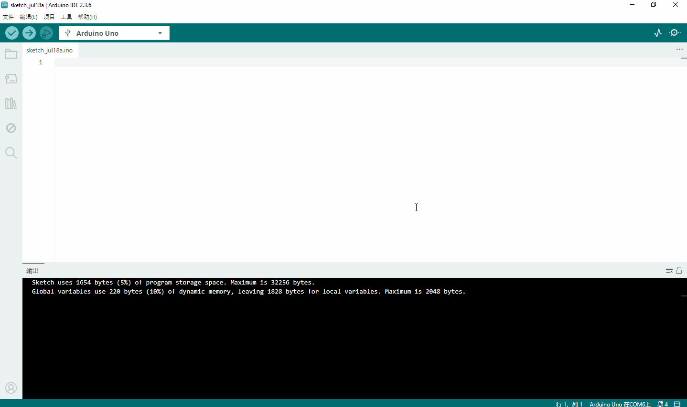

四、ESP32开发板环境配置
-----------------------

**特别提醒：
ESP32开发板资源地址：https://espressif.github.io/arduino-esp32/package_esp32_index.json**

Windows和Mac系统操作方法均如下

.. figure:: media/22.gif
   :alt: img

**假如，由于网络问题实在是下载安装不了ESP32开发板，我们也提供有ESP32开发板的压缩包**\ ，\ **ESP32开发板的压缩包下载地址：**
https://pan.baidu.com/s/10mfU2_aNru2dizP0vAFXlw?pwd=95ih

**提取码：95ih**

**压缩包下载后解压，把解压后的ESP32开发板文件夹按照以下路径添加。ESP32开发板一般需要存放于以下路径，才能说明ESP32开发板安装好。**

- **Windows
  系统**\ ：路径为C::raw-latex:`\Users`:raw-latex:`\你的用户名`:raw-latex:`\AppData`:raw-latex:`\Local`:raw-latex:`\Arduino15`:raw-latex:`\packages` 。其中，AppData 是一个隐藏文件夹，你需要在文件夹选项中开启
  “显示隐藏的文件、文件夹和驱动器” 才能看到。
- **macOS
  系统**\ ：位于~/Library/Arduino15/packages。Library 也是一个隐藏文件夹，你可以通过在
  “\ **访达**\ ” 中使用快捷键Command + Shift +
  G ，然后输入该路径来访问。
- **Linux 系统**\ ：存于~/.arduino15/packages 。

代码上传测试
~~~~~~~~~~~~

特别提醒： 请先将您产品的开发板使用数据线接入电脑

::

   void setup() {  
       // 把你的设置代码放在这里，运行一次:
       Serial.begin(9600);  //设置串口波特率为9600
   }

   void loop() {  
       // 将主代码放在这里，以便重复运行:
       Serial.println("ESP32开发环境配置完成");  //串口打印
       delay(1000);  //延迟1秒
   }

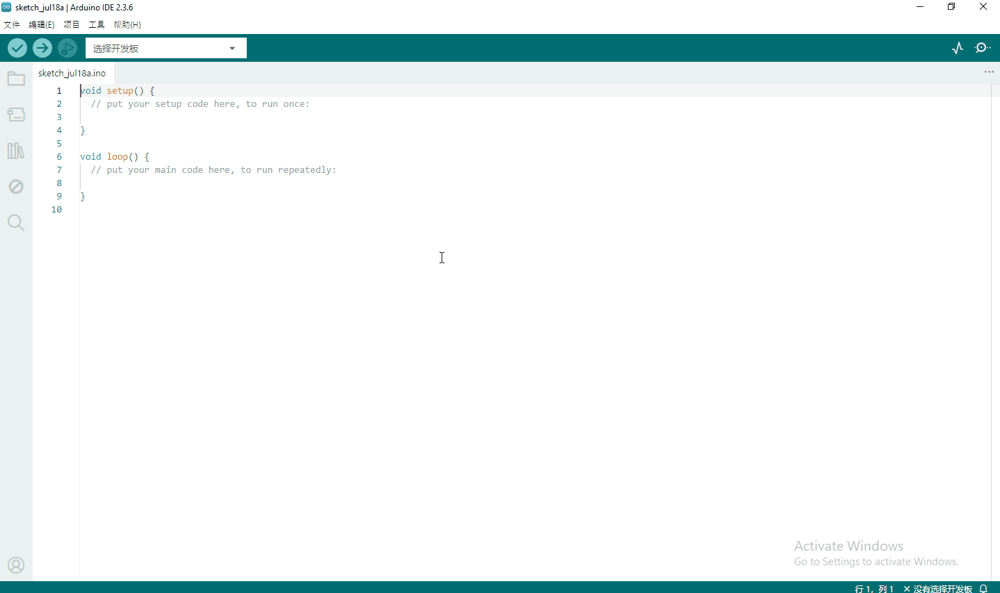

五、树莓派Pico板开发环境配置
----------------------------

树莓派pico环境下载
~~~~~~~~~~~~~~~~~~

**特别提醒：树莓派Pico开发板资源地址：https://github.com/earlephilhower/arduino-pico/releases/download/global/package_rp2040_index.json**

以下两种开发环境请根据实际产品教程选择

环境一：(Raspberry Pi Pico/RP2040/RP2350)

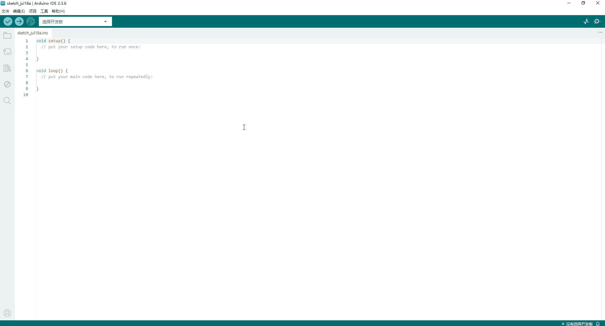

环境二：(Arduino Mbed OS RP2040 Boards)

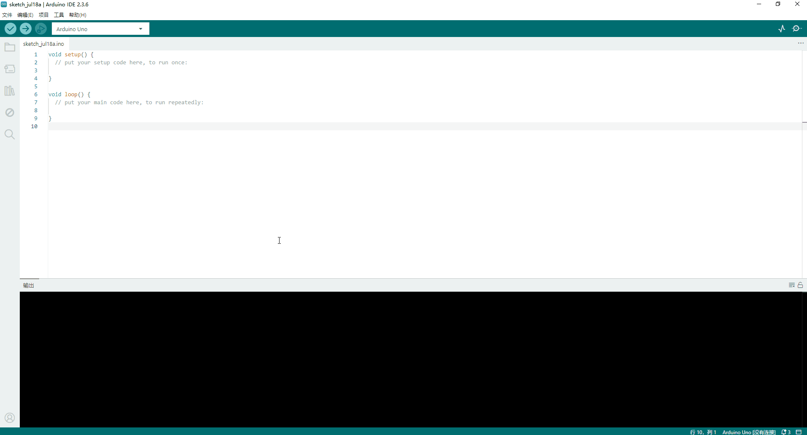

上传Arduino兼容的Pico固件（以Arduino Mbed OS RP2040 Boards环境演示）
~~~~~~~~~~~~~~~~~~~~~~~~~~~~~~~~~~~~~~~~~~~~~~~~~~~~~~~~~~~~~~~~~~~~

**特别提醒： 如果你的树莓派 Pico 板是新的，想使用Arduino
IDE学习和开发，则需要上传一个Adruino兼容的Raspberry Pi
Pico固件。请参考以下步骤配置:(有时在使用时，树莓派 Pico
板可能会丢失固件而无法工作。此情况也需要进行改步骤操作)**

步骤一：

将数据线一端先接到电脑。再按住树莓派 Pico
板上的白色按钮(BOOTSEL)，最后将数据线的另外一端接到树莓派 Pico
板，确认接好后再松开白色按钮(BOOTSEL)。

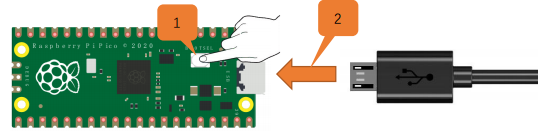

.. figure:: media/27.gif
   :alt: 0722

步骤二：

上传代码：

效果：

树莓派 Pico 板上的指示灯开始闪烁。

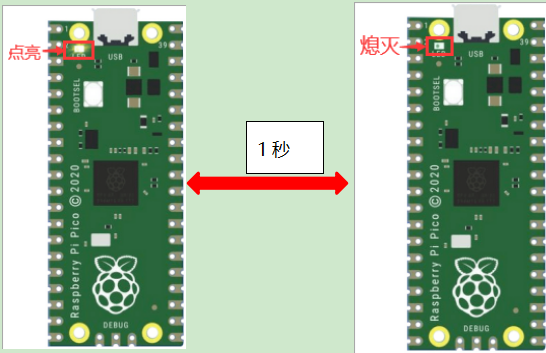

**特别提醒：
单击“工具”→“端口”→COMx。COMx的X在不同的电脑上是不同的。请在你的电脑上选择正确的COM口。**

.. _代码上传测试-1:

代码上传测试
~~~~~~~~~~~~

特别提醒： 请先将您产品的开发板使用数据线接入电脑

::

   void setup() {  
       // 把你的设置代码放在这里，运行一次:
       Serial.begin(9600);  //设置串口波特率为9600
   }

   void loop() {  
       // 将主代码放在这里，以便重复运行:
       Serial.println("pico开发环境配置完成");  //串口打印
       delay(1000);  //延迟1秒
   }

   999

六、 给Arduino IDE安装库文件（以ESP32为例，其他开发板一致）
-----------------------------------------------------------

什么是库文件
~~~~~~~~~~~~

库是代码的集合，使您可以轻松地连接到传感器、显示器、模块等。

例如：LiquidCrystal_I2C库使LCD1602显示屏的编程变得容易
。在编译代码或上传代码时如果出现报错 “No such file or directory”
那就是缺少库文件，如下就是上传LCD1602模块代码时因为缺少了LiquidCrystal_I2C库文件的报错。

::

   #include <LiquidCrystal_I2C.h>
   int lcdColumns = 16;
   int lcdRows = 2;
   LiquidCrystal_I2C lcd(0x27, lcdColumns, lcdRows);

   void setup(){
     lcd.init();
     lcd.backlight();
   }

   void loop(){
     lcd.setCursor(0, 0);
     lcd.print("Hello, World!");
     delay(1000);
   }

如何安装库文件
~~~~~~~~~~~~~~

方法一：（软件内添加）

我们以添加LiquidCrystal_I2C库文件为例。

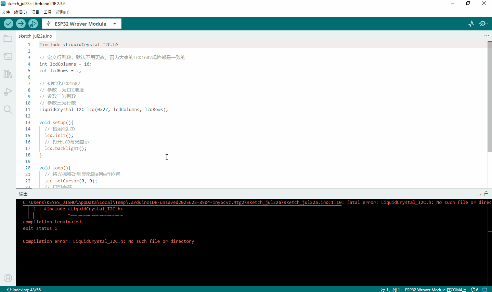

方法二：（导入zip格式的库文件压缩包）

.. figure:: media/33.gif
   :alt: 98

MAC 系统 和 Windows 系统添加方法类似，可以参照，就不一一讲述了。

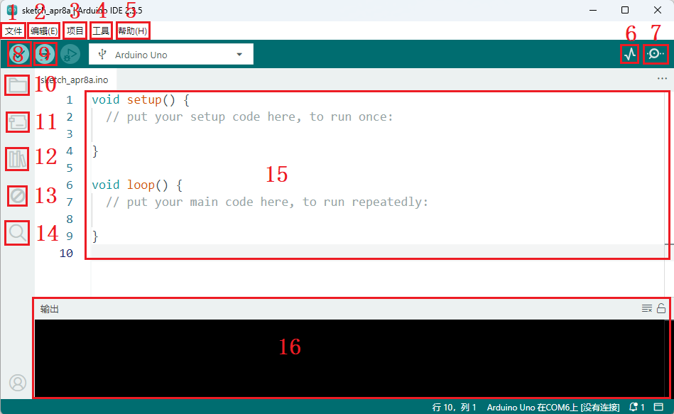
.. |img| image:: https://www.keyesrobot.cn/projects/Arduino/zh-cn/latest/_images/7d0b506b49c64603a88fe3e435471416.png
.. |image2| image:: https://www.keyesrobot.cn/projects/Arduino/zh-cn/latest/_images/eaa1b19bfcaca2517a95e05ded42d35c.png
.. |image3| image:: https://www.keyesrobot.cn/projects/Arduino/zh-cn/latest/_images/1aca98d5c71572a604e19486bd0b0f30.png
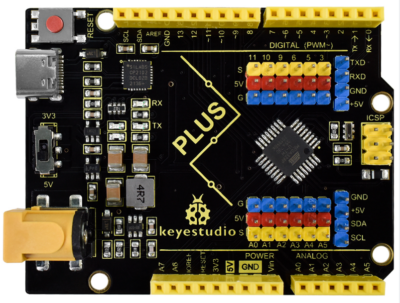
.. |image5| image:: https://www.keyesrobot.cn/projects/Arduino/zh-cn/latest/_images/86c795bcea492965e34ee0cdaaf50e29.png
.. |image6| image:: media/14.png
.. |image7| image:: https://www.keyesrobot.cn/projects/Arduino/zh-cn/latest/_images/673abb3eab021c25e5f25278a56c090f.png
.. |image8| image:: https://www.keyesrobot.cn/projects/Arduino/zh-cn/latest/_images/844294c4c8ececb90208e002a168053f.png
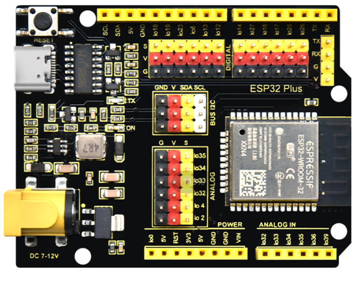
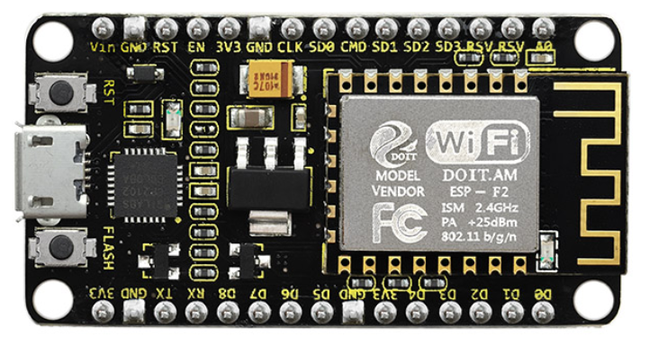
