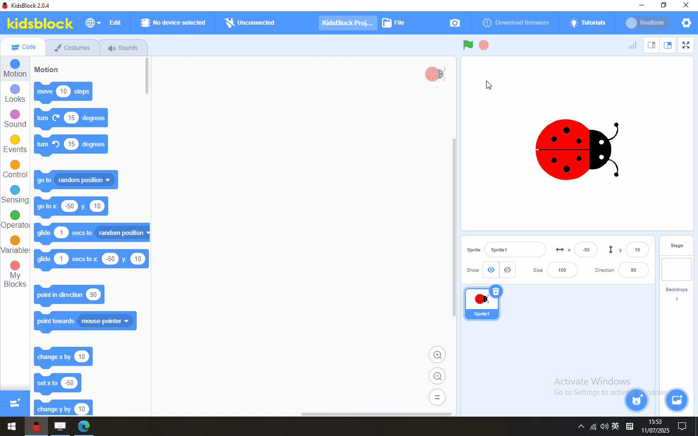
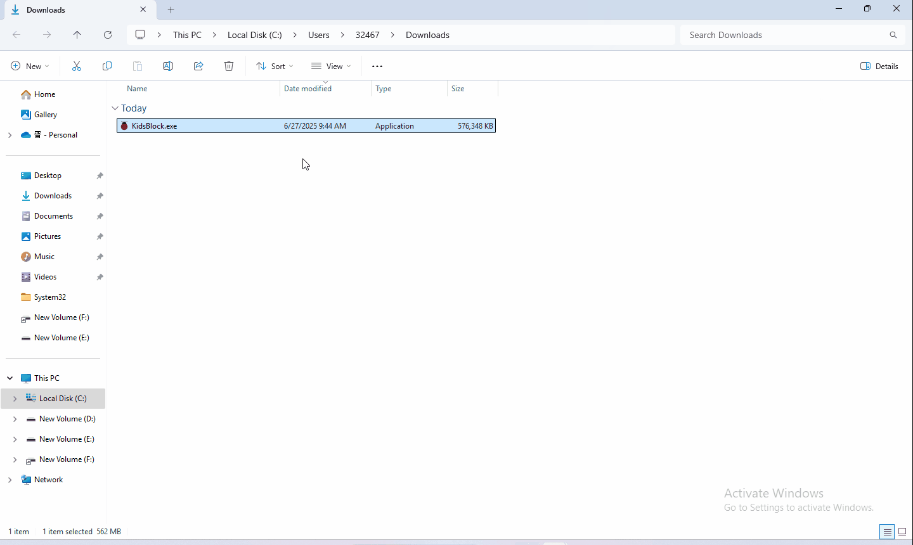
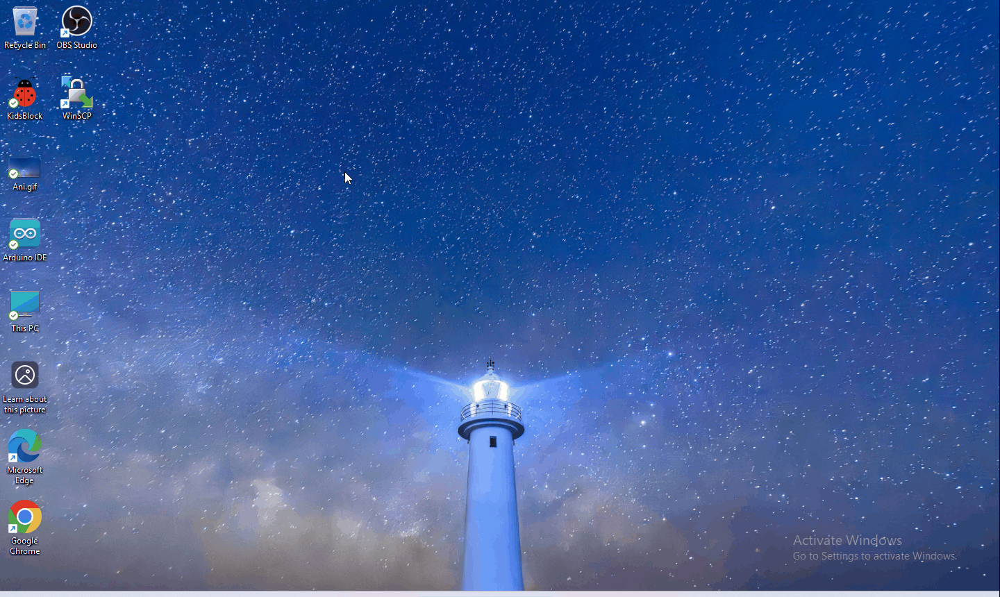

KidsBlock Software
==================

1.Software installation of Windows System
-----------------------------------------

1. Download kidsblock: https://xiazai.keyesrobot.cn/KidsBlock.exe

   .. figure:: ./media/qq.gif
      :alt: qq

2. software installation

|image1|

2 Software installation of Mac System
-------------------------------------

1.Download kidsblock: https://xiazai.keyesrobot.cn/KidsBlock.dmg

.. figure:: ./media/i.gif
   :alt: i

3. How to use KidsBlock
=======================

1、operating software

First connect the development board to the computer

|image2|

2、If you are unable to upload the code, please refer to the following
tutorial to install the driver (optional reading)

Install driver（MAC)

.. figure:: ./media/qqq.gif
   :alt: qqq

Install driver（Windows)

