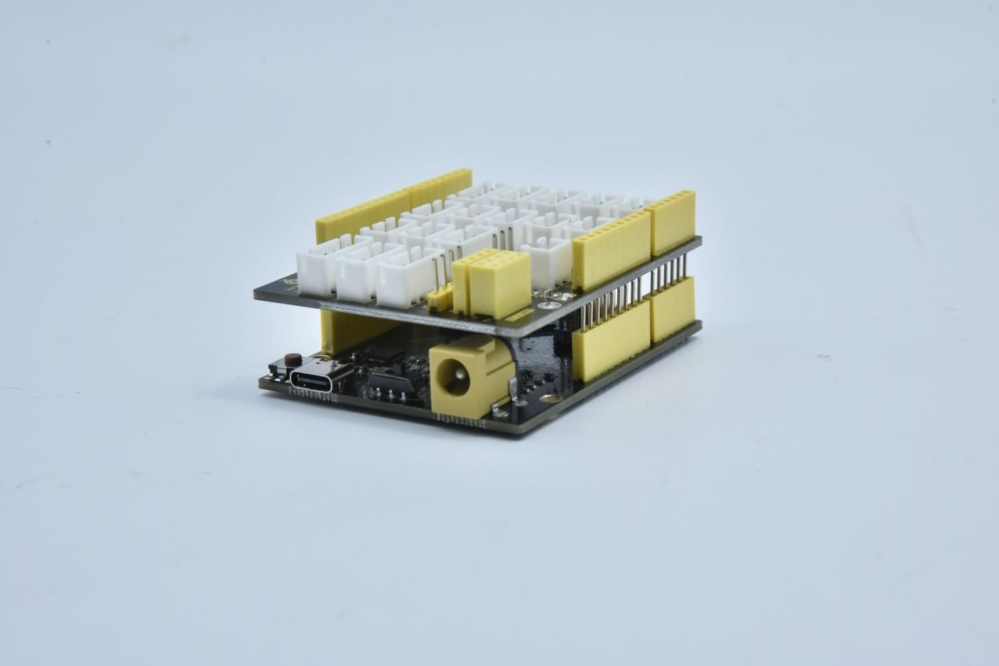

TEXT
====

Keyestudio Sensor Shield V6 for Arduino
---------------------------------------

[**1.Description**]

Keyestudio Sensor Shield V6 for Arduino is suitable for UNO development
board, which can be plugged into the UNO development board without the
external power supply.

In the case of retaining the original IO port, the PH2.54 anti-reverse
plug terminals are used, which lead to the IO port of the UNO
development board. The PH2.54 plug avoids the wrong connection and
protects the UNO motherboard and sensors. Furthermore, each IO port is
equipped with independent VCC and GND interfaces in a way that make it
easier for sensor connection. 

The interface of motors, seven-color LEDs and RGB on the car are drawn
out, we solely need a wire with anti-reverse plug terminal from the
interface on the corresponding bottom plate, which is simple and
convenient.  In addition, we also reserved some interfaces, IIC, UART,
and WIFI interface.  It must be noted that this board is powered by the
base board 2PIN terminal 5V.

[**2.Specifications**]

Current：The maximum is 1.2A (the maximum total current provided by IO
of arduino UNO is 200mA, and the maximum is 1A for wifi module) 

DC input voltage：5V

Output voltage：DC 3.3V\\5V

Maximum power: 4.3W

Recommended ambient temperature：-10°C ~ 50°C

Dimension：70*55*27mm

Weight: 25.5g

**[3.Schematic Diagram]**

|image1|

**[4.Interface]**

.. figure:: ./media/image2.png
   :alt: QQ图片20220429160920

   QQ图片20220429160920

**[5.Using Method]**

Stack the expansion board on the Keyestudio UNO PLUS development board,
as shown below:

   \_DSC3308

.. |image1| image:: ./media/image1.png
