**How to use KidsBlock on Windows system**

1. Interface

|image1|

2. Click\ |image2|\ to switch to different languages

   .. figure:: ./media/image3.png
      :alt: 无标题

      无标题

   3. Click\ |image3|\ to select”\ **Install driver**\ ”.

   Note: If the driver is not installed, as shown below;

|image4|

A. Click “Next” at the **Device Driver Installation Wizard** page.

|image5|

.. raw:: html

   <!-- -->

B. After a while, click”Finish”

|image6|

C. Then click”Next”.

|image7|

D. And click”Finish”.

|image8|

E. Then click”\ **Allow**\ ”and”\ **Install**\ ”

|image9|

F. After a while，click”Finish”

|image10|

G. Select”Extract”

|image11|

H. Click”\ **Next**\ ”

|image12|

I. Next, click”\ **I accept this agreement**\ ”and”\ **Next**\ ”。

|image13|

J. Click”Finish”.

|image14|

K. After a while, click”\ **INSTALL”**

|image15|

.. raw:: html

   <!-- -->

O. After a few seconds, when the driver is installed, just
   click”\ **OK**\ ”

|image16|

Click |image17| to enter the main page, select the control board needed.
In this project, we select the Uno Plus mainboard and click **Connect,**
then it is connected.

Click **Go to Editor** to return the code editor.

Icon |image18| will change into |image19| and |image20|\ will change
into |image21|. This means the Uno Plus mainboard and ports（COM）are
connected.

|image22|

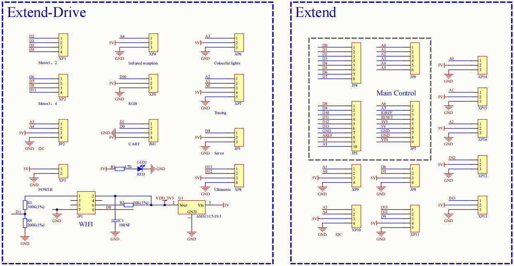
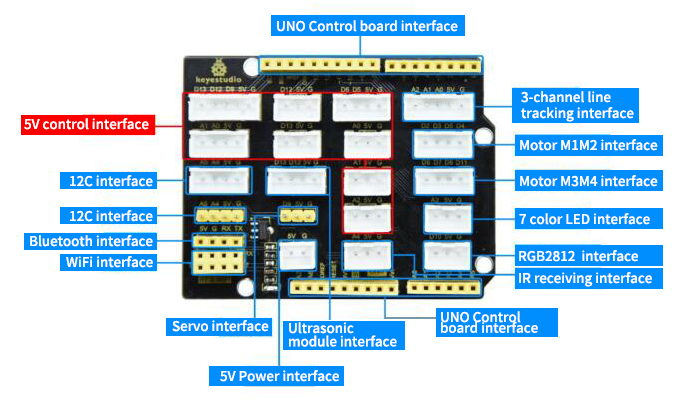

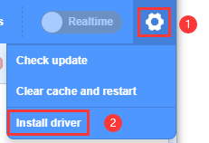
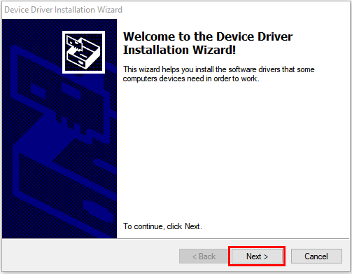
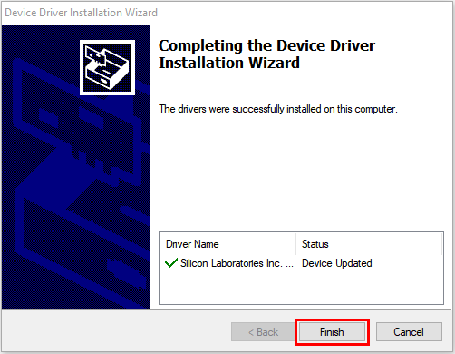
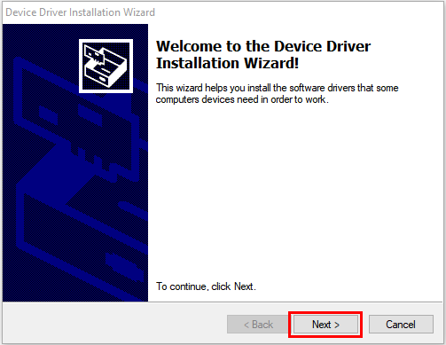
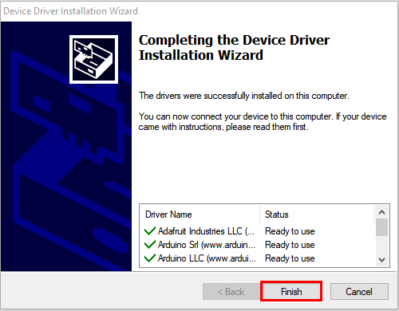
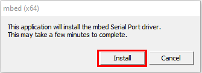
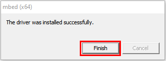
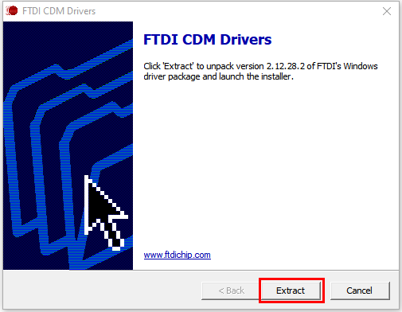
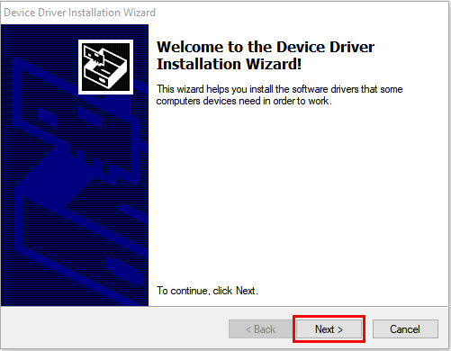
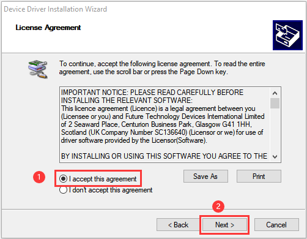
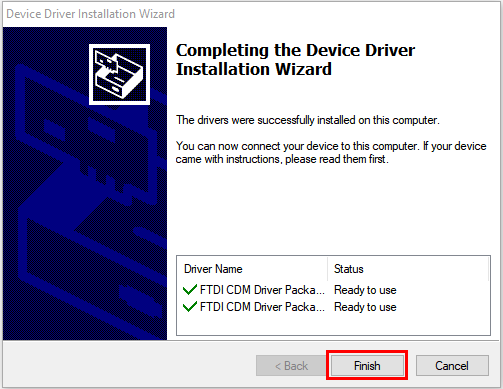
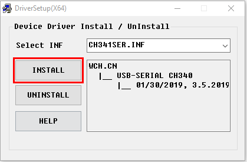
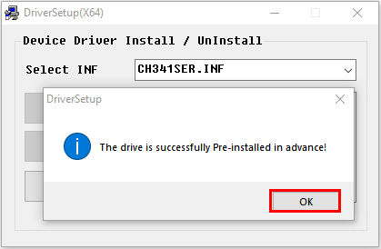

.. |image20| image:: ./media/image20.png

.. |image22| image:: ./media/image22.png
