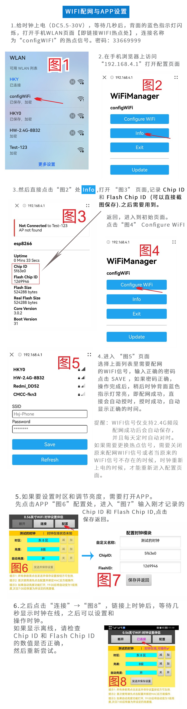
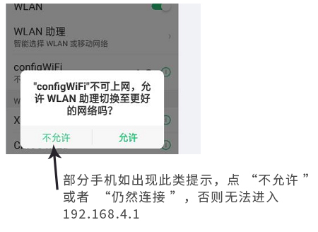

0.56-WIFI授时版
===============

1. 软件下载
-----------

:download:`软件 <./timeTool_DK056_CN（中文）.7z>`

2. 操作说明
-----------

|image1|

**配网注意点：**

1.时钟配网支持2.4G频段的WIFI信号，无线路由器都有2.4G频段的，有些是2.4G
和
5.8G合并的，可能会配网失败，如果配网失败，请进路由器将WIFI信号分开（市场上的无线路由器都有2.4G频段这功能）。

2.连接的热点名称和密码不要中文和特殊字符，否则可能也无法连接。

3.当手机连上 Configwifi
这个时钟热点的时候，部分手机会提示，\ **“该热点无法上网，询问是否切换到其他网络”
点 “仍然需要连接或者不切换” ，**\ 否则无法进入 192.168.4.1 。

|image2|

