|image1|

|image2|

|image3|

To disconnect the port, just click |image4| and **Disconnect**

|image5|

The Uno Plus mainboard and the COM port are connected, then click
|image6|\ to switch modes. Then |image7| will change into |image8|

|image9|

|image10|

|image11|

Note: if you want to update libraries of KidsBlock, click |image12| then
Clear cache and restart

|image13|

|image14|\ stands for extension libraries of sensors and modules.

Click |image15| to enter the page of extension libraries, click a sensor
or module to add.

For example, if click the”passive buzzer”module\ |image16|,“Not
loaded”will change into”Loaded”. Then the passive buzzer is added

|image17| |image18|

Click |image19| to return the code editor. Then you can view the passive
buzzer in the blocks area.

|image20|

If you want to delete the passive buzzer, click |image21| to select the
passive buzzer\ |image22|. Then”Loaded”will change into”Not loaded”.

Then the passive buzzer is deleted.

|image23| |image24|

The way of deleting other sensors or modules is as same as the passive
buzzer.

3. How to open SB3 type files：

1：Double-click SB3 type files to open them.

For instance, open |image25|, then we need to double-click\ |image26| .

|image27|

2. Open Kidsblock，click **file and Load from your computer**\ ，then
   select the SB3 type file on the computer.（for example |image28|\ ）

|image29|

|image30|

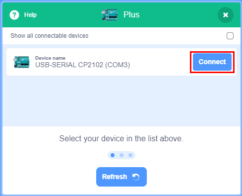
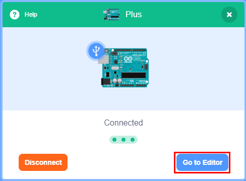
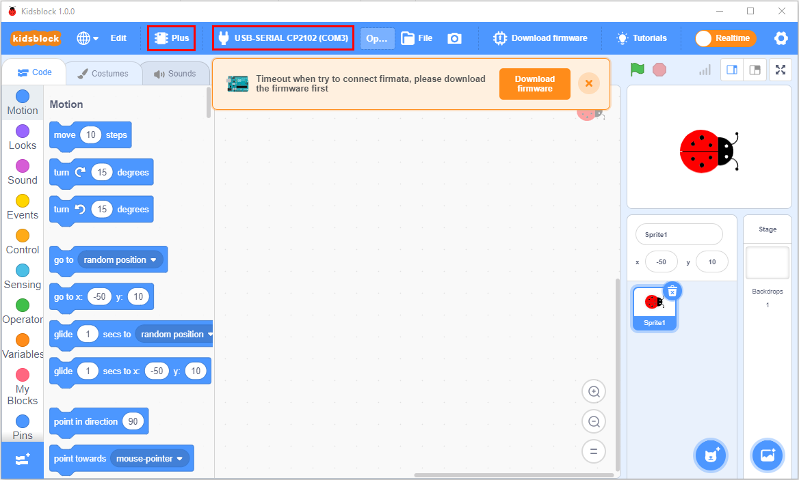
.. |image4| image:: ./media/image21.png
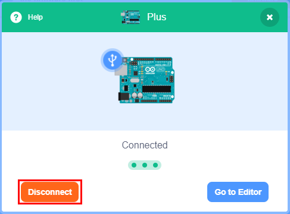
.. |image6| image:: ./media/image30.png
.. |image7| image:: ./media/image30.png
.. |image8| image:: ./media/image31.png
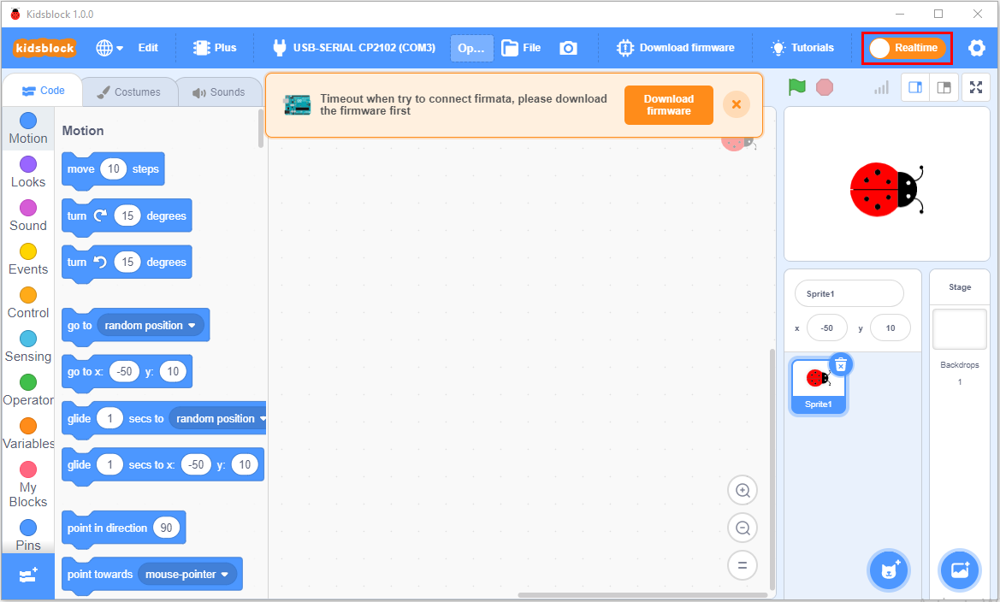
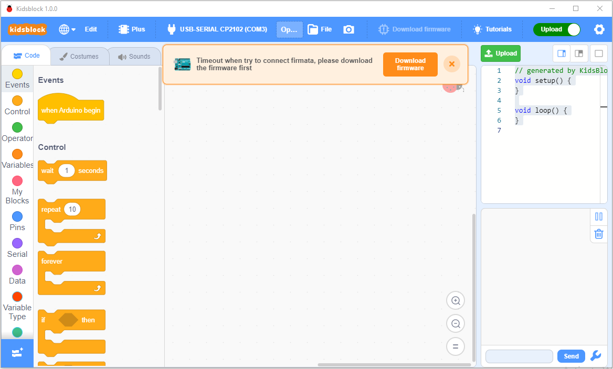
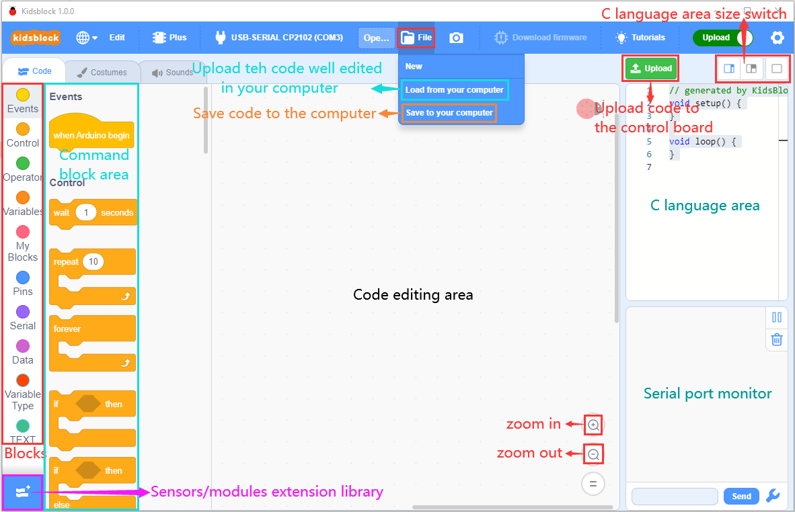

.. |image13| image:: ./media/image36.png
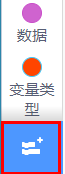

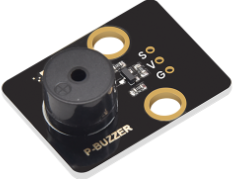
.. |image17| image:: ./media/image39.png
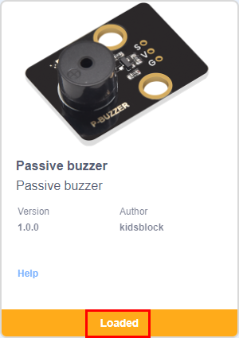
.. |image19| image:: ./media/image41.png
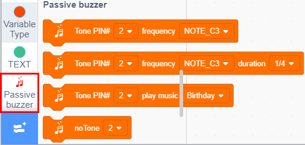

.. |image24| image:: ./media/image39.png

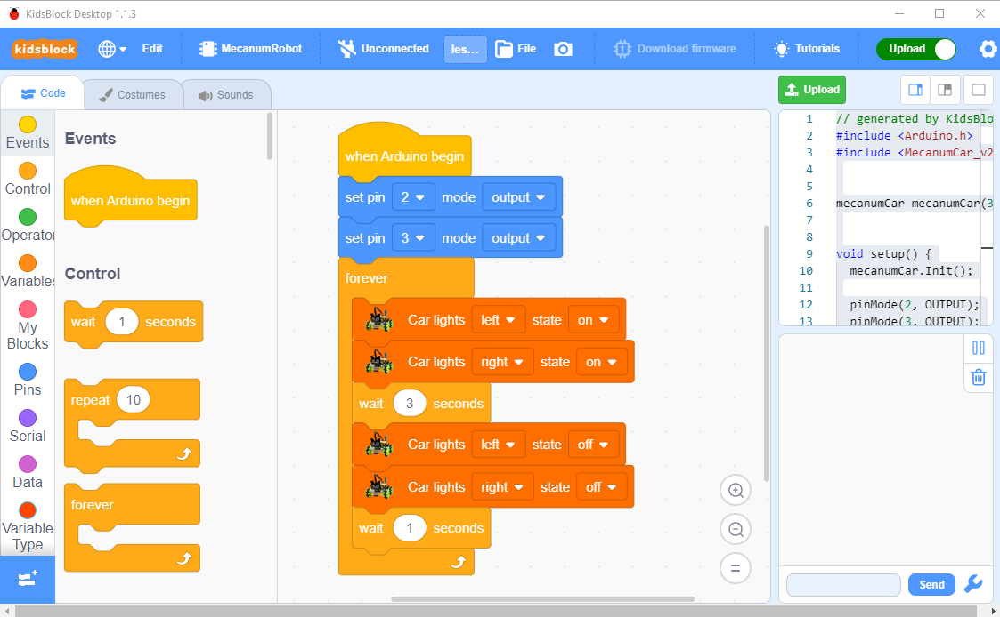

.. |image29| image:: ./media/image45.png

