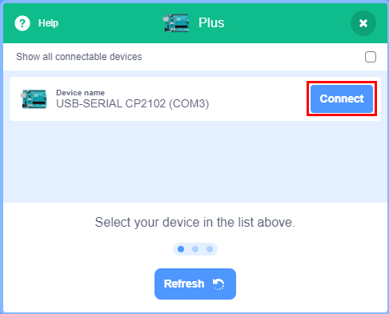
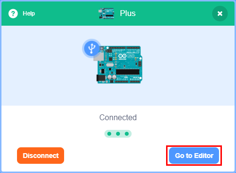
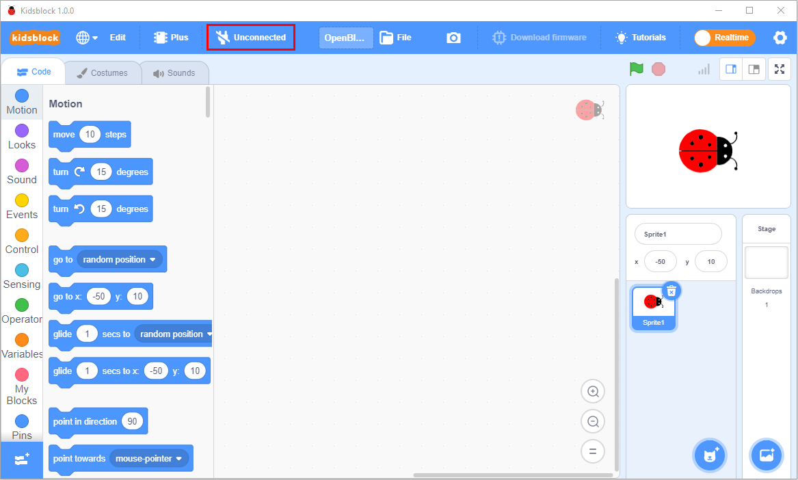

Interface

|image1|

2. Click\ |image2|\ to switch to different languages

   .. figure:: ./media/image3.png
      :alt: 无标题

      无标题

   3. Click\ |image3|\ to select”\ **Install driver**\ ”.

   Note: If the driver is not installed, as shown below;

|image4|

A. Click “Next” at the **Device Driver Installation Wizard** page.

|image5|

.. raw:: html

   <!-- -->

B. After a while, click”Finish”

|image6|

C. Then click”Next”.

|image7|

D. And click”Finish”.

|image8|

E. Then click”\ **Allow**\ ”and”\ **Install**\ ”

|image9|

F. After a while，click”Finish”

|image10|

G. Select”Extract”

|image11|

H. Click”\ **Next**\ ”

|image12|

I. Next, click”\ **I accept this agreement**\ ”and”\ **Next**\ ”。

|image13|

J. Click”Finish”.

|image14|

K. After a while, click”\ **INSTALL”**

|image15|

.. raw:: html

   <!-- -->

O. After a few seconds, when the driver is installed, just
   click”\ **OK**\ ”

|image16|

Click |image17| to enter the main page, select the control board needed.
In this project, we select the Uno Plus mainboard and click **Connect,**
then it is connected.

Click **Go to Editor** to return the code editor.

Icon |image18| will change into |image19| and |image20|\ will change
into |image21|. This means the Uno Plus mainboard and ports（COM）are
connected.

|image22|

|image23|

|image24|

|image25|

If the Uno Plus mainboard is connected , but icon |image26|\ doesn’t
change into |image27|. You need to click |image28|\ to connect the COM
port.

Click |image29| and **Connect.**

Then you will find a page pop up, showing **Connected.**

|image30|

|image31|

|image32|

|image33|

To disconnect the port, just click |image34| and **Disconnect**

|image35|

The Uno Plus mainboard and the COM port are connected, then click
|image36|\ to switch modes. Then |image37| will change into |image38|

|image39|

|image40|

|image41|

Note: if you want to update libraries of KidsBlock, click |image42| then
Clear cache and restart

|image43|

|image44|\ stands for extension libraries of sensors and modules.

Click |image45| to enter the page of extension libraries, click a sensor
or module to add.

For example, if click the”passive buzzer”module\ |image46|,“Not
loaded”will change into”Loaded”. Then the passive buzzer is added

|image47| |image48|

Click |image49| to return the code editor. Then you can view the passive
buzzer in the blocks area.

|image50|

If you want to delete the passive buzzer, click |image51| to select the
passive buzzer\ |image52|. Then”Loaded”will change into”Not loaded”.

Then the passive buzzer is deleted.

|image53| |image54|

The way of deleting other sensors or modules is as same as the passive
buzzer.

3. How to open SB3 type files：

1：Double-click SB3 type files to open them.

For instance, open |image55|, then we need to double-click\ |image56| .

|image57|

2. Open Kidsblock，click **file and Load from your computer**\ ，then
   select the SB3 type file on the computer.（for example |image58|\ ）

|image59|

|image60|

.. |image1| image:: ./media/image1.png
.. |image2| image:: ./media/image2.png
.. |image3| image:: ./media/image4.png
.. |image4| image:: ./media/image5.png
.. |image5| image:: ./media/image6.png
.. |image6| image:: ./media/image7.png
.. |image7| image:: ./media/image8.png
.. |image8| image:: ./media/image9.png
.. |image9| image:: ./media/image10.png
.. |image10| image:: ./media/image11.png
.. |image11| image:: ./media/image12.png
.. |image12| image:: ./media/image13.png
.. |image13| image:: ./media/image14.png
.. |image14| image:: ./media/image15.png
.. |image15| image:: ./media/image16.png
.. |image16| image:: ./media/image17.png
.. |image17| image:: ./media/image18.png
.. |image18| image:: ./media/image18.png
.. |image19| image:: ./media/image19.png
.. |image20| image:: ./media/image20.png
.. |image21| image:: ./media/image21.png
.. |image22| image:: ./media/image22.png

.. |image25| image:: ./media/image25.png
.. |image26| image:: ./media/image20.png
.. |image27| image:: ./media/image21.png
.. |image28| image:: ./media/image20.png
.. |image29| image:: ./media/image20.png

.. |image31| image:: ./media/image27.png
.. |image32| image:: ./media/image28.png
.. |image33| image:: ./media/image25.png
.. |image34| image:: ./media/image21.png
.. |image35| image:: ./media/image29.png
.. |image36| image:: ./media/image30.png
.. |image37| image:: ./media/image30.png
.. |image38| image:: ./media/image31.png
.. |image39| image:: ./media/image32.png
.. |image40| image:: ./media/image33.png
.. |image41| image:: ./media/image34.png
.. |image42| image:: ./media/image35.png
.. |image43| image:: ./media/image36.png
.. |image44| image:: ./media/image37.png
.. |image45| image:: ./media/image37.png
.. |image46| image:: ./media/image38.png
.. |image47| image:: ./media/image39.png
.. |image48| image:: ./media/image40.png
.. |image49| image:: ./media/image41.png
.. |image50| image:: ./media/image42.png
.. |image51| image:: ./media/image37.png
.. |image52| image:: ./media/image38.png
.. |image53| image:: ./media/image40.png
.. |image54| image:: ./media/image39.png
.. |image55| image:: ./media/image43.png
.. |image56| image:: ./media/image43.png
.. |image57| image:: ./media/image44.png
.. |image58| image:: ./media/image43.png
.. |image59| image:: ./media/image45.png
.. |image60| image:: ./media/image44.png
